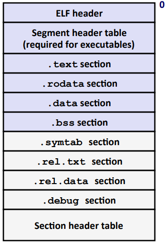
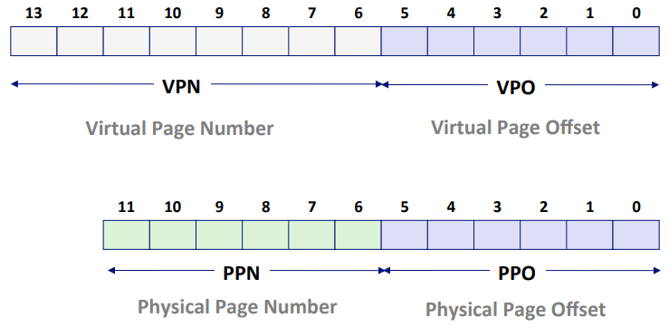
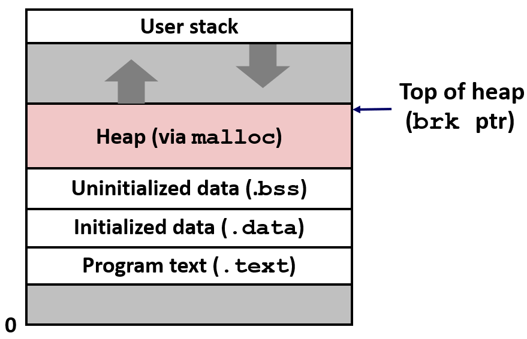
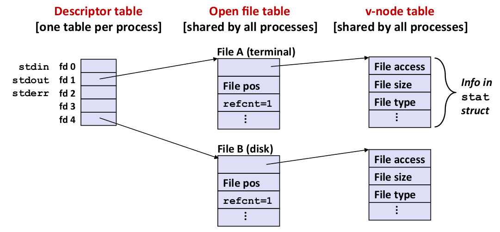
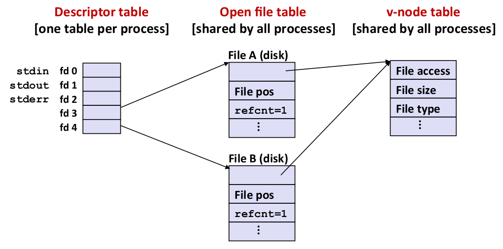

# Computer Systems: A Programmer's Perspective

## A Tour of Computer System

从某种意义上来说，本书的目的就是要帮助你了解当你的系统上执行 hello 程序时，系统发生了什么以及为什么会这样

```C
#include <stdio.h>

int main()
{
    printf("hello, world\n");
    return 0;
}
```

通过跟踪 hello 程序的生命周期来开始对系统的学习——从它被程序员创建开始，到在系统上运行，输出简单的消息，然后终止

### 信息就是位+上下文

hello 程序的生命周期是从一个*源程序*（或源文件）开始的，即程序员通过编辑器创建并保存的文本文件，文件名是 hello.c
源程序实际上就是一个由值0和1组成的位（比特 bit），8个位被组织成一组，称为*字节*
每个字节表示程序中的某些文本字符

大部分现代计算机系统都使用ASCII标准来表示文本字符，这种方式实际上就是用一个唯一的单字节大小的整数值来表示每个字符

hello.c 程序是以字节序列的方式存储在文件中的。每个字节都有一个整数值，对应于某些字符。像 hello.c 这样只由 ASCII 字符构成的文件称为文本文件，所有其他文件都称为*二进制文件*

hello.c 的表示方法说明链一个基本思想：系统中所有的信息都是由一串比特表示的。区分不同数据对象的唯一方法是这些数据的上下文。在不同的上下文中，一个同样的字节序列可能表示一个整数、浮点数、字符串或者机器指令

### 程序被其他程序翻译成不同的格式


预处理阶段：预处理器（cpp）根据以字符 # 开头的命令，修改原始的C程序，得到另一个C程序，通常是以 .i 作为文件扩展名
编译阶段：编译器（ccl）将文本文件 hello.i 翻译成文本文件 hello.s，它包含一个汇编语言程序。

汇编阶段：汇编器（ss）将 hello.s 翻译成机器语言指令，把这些指令打包成一种叫做*可重定位目标程序*（relocatable object program）的格式，并将结果保存在目标文件 hello.o 中。hello.o 文件是一个二进制文件
链接阶段：hello 程序调用了 printf 函数，它是每个C编译器都提供的标准C库中的一个函数。printf 函数存在于一个名为 printf.o 的单独的预编译好了的目标文件中，而这个文件必须以某种方式合并到 hello.o 程序中。链接器（ld）就负责处理这种合并。结果就得到 hello 文件，它是一个*可执行目标文件*（或简称未可执行文件），可以被加载到内存中，由系统执行

## Representing and Manipulating Information

这里主要研究三种重要的数字表示
**无符号**（unsigned）编码基于传统的二进制表示法，表示大于或等于零的数字
**补码**（tow's-complement）编码是表示有符号整数的最常见的方式
**浮点数**（floating-point）编码是表示实数的科学记数法的以2为基数的版本
计算机的表示法是用有限数量的位来对一个数组编码，因此当结果太大以至不能表示时，某些运算就会*溢出*（overflow）
由于表示的精度有限，浮点运算是不可组合的
整数的表示虽然只能编码一个相对较小的数值范围，但是这种表示是精确的，而浮点数只是近似的

### Information Storage

大多数计算机使用8位的块，或者*字节*（byte），作为最小的可寻址的内存单位，而不是访问内存中独立的位。

#### 字数据大小

每台计算机都有一个*字长*（Word size），指明指针数据的标称大小（nominal size）
因为虚拟地址是以这样的一个字来编码的，所以字长决定的最重要的系统参数就是虚拟地址空间的最大大小
32位字长限制虚拟地址空间位4GB（因此32位系统不支持4G以上内存），64位则为16EB

大多数 64 位机器也可以运行 32 位机器编译的程序（向下兼容）

```bash
linux> gcc -m32 prog.c  #可以在 32 位或 64 位机器上运行 
linux> gcc -m64 prog.c  #只能在 64 位机器上运行
```

| C Data Type | 32-bit | 64-bit |
|---|---|--|
| char | 1 | 1 |
| short | 2 | 2 |
| int | 4 | 4 |
| long | 4 | 8 |
| float | 4 | 4 |
| double | 8 | 8 |
| printer | 4 | 8 |

#### 寻址和字节顺序

对于跨越多字节的程序对象必须建立两个规则：这个对象的地址是什么，以及在内存中如何排列这些字节
在几乎所有的机器上，多字节对象都被存储为连续的字节序列，对象的地址为所使用字节中最小的地址

大端法

小端法

### Integer(整数表示)

#### 整数数据类型

#### 无符号数的编码

#### 补码编码

#### 有符号数和无符号数之间的转换

### Integer Arithmetic(整数运算)

#### 无符号加法

#### 补码加法

#### 无符号乘法

#### 补码乘法

#### 乘以常数

#### 除以 2 的幂


计算机执行的“整数”运算实际上是一种模运算形式。表示数字的有限字长限制链可能的值的取值范围，运算结果可能溢出
补码表示提供了一种表示正负数的灵活方法，同时使用了与执行无符号算术相同的位级实现，无论运算数是以无符号形式还是以补码形式表示的，都有完全一样或者非常类似的位级行为

### Floating Point(浮点数)

#### 二进制小数


#### IEEE浮点表示

IEEE 浮点标准用 $ V=(-1)^s \times M \times 2^E $ 的形式来表示一个数：

- 符号（sign）：s 决定这数是负数（s=1）还是正数（s=0），而对于数值 0 的符号位解释作为特殊情况处理
- 尾数（significand）：$M$ 是一个二进制小数，它的范围是 $ 1 \sim 2-\epsilon$ 或者是 $ 0 \sim 1-\epsilon $
- 阶码（exponent）：$E$ 的作用是对浮点数加权，这个权重是 2 的 $E$ 次幂（可能是负数）

将浮点数的位表示划分为三个字段，分别对这些值进行编码：

- 一个单独的符号位 s 直接编码符号 s
- $k$ 位的阶码字段 $exp=e_{k-1}...e_1 e_0$ 编码阶码 $E$
- $n$ 位小数字段 $frac=f_{n-1}...f_1 f_0$ 编码尾数 $M$，但是编码出来的值也依赖于阶码的值是否等于 0

下图给出了将这三个字段装进字中两种最常见的格式。
在单精度浮点格式（C语言中的float）中，s、exp和frac字段分别为 1 位、$k=8$ 位和 $n=23$ 位，得到一个32位的表示
在双精度浮点格式（C语言中的double）中，s、exp和frac字段分别为 1 位、$k=11$ 位和 $n=52$ 位，得到一个64位的表示


#### 数字实例

#### rounding(舍入)

#### 浮点运算

## Machine-Level Representation of Programs

1978 年，Intel 发布了第一款 x86 指令集的微处理器 8086，以此拉开了 Intal x86 系列发展的序幕。但 AMD 开发了 x86-64 架构（AMD64）

从 C 到机器代码

机器代码是处理器能够直接执行的字节层面

### 程序编码

### 数据格式

### Accessing Information(访问信息)

一个 x86_64 的CPU包含一组16个存储64bit值的*通用目的寄存器*，这些寄存器用来存储整数数据和指针

### 算术和逻辑操作

### 控制

#### 条件码

#### 访问条件码

#### 跳转指令

#### 跳转指令的编码

#### 用条件控制来实现条件分支

#### 循环

#### switch 语句

### 过程

#### 运行时栈

#### 控制转移

#### 数据传送

#### 栈上的局部存储

#### 递归过程

### 数组分配和访问

## Optimizing Program Performance(优化程序性能)

### Capabilities and Limitations of Optimizing Compilers

编译器并不能真正理解你使用的数字，当定义一个 int，但实际它的取值范围是比 int 小很多的子集
编译器也很难理解内存引用模式和过程调用的影响
一般来说，编译器有一整套优化策略，但总的来说，编译器对不确定能否进行优化的地方不会进行优化

### Eliminating Loop Inefficiencies(消除循环的低效率)

### Reducing Procedure Calls(减少过程调用)

### Eliminating Unneeded Memory References(消除不必要的内存引用)

## The Memory Hierarchy

内存实际上叫做 Random-Access Memory (RAM)，它一般被封装成芯片，多个芯片组合构成主存（main memory）
最基本的存储单位称为单元（call），一个单元存储一个 bit

RAM 根据存储单元的实现方式可以分为两种

|   | Tans. per bit | Access time | Needs refresh? | Needs EDC? | Application |
|---|---|
|   |   |


- SRAM（Static RAM）：需要4或6个晶体管存储 1 bit，访问速度几个时钟周期
- DRAM（Dynamic RAM）：只需要一个晶体管存储 1 bit，

I/O Bus

磁盘、USB等设备通过 I/O 桥链接到 CPU 和内存，I/O 桥和各个外部设备通过 I/O 总线链接，每根线路一个时钟周期传输1 bit 的信息
以前的PCI总线对于各个设备是共享的，如果总线上任何设备修改了某个值，该总线上的每个设备都可以看到，称为广播总线
现代系统使用 PCI Express 的总线结构，它是点对点的，可以达到更快的速度

直接内存访问（direct memory access，DMA）：磁盘控制器通过 I/O 桥直接将数据复制到内存中，而无需经过 CPU，当数据传输完成，使用中断（interrupt）机制通知 CPU，它实际上是 CPU 芯片上的一个引脚
对于 CPU 来说，某处有某个程序正在等待数据读入内存，受到中断通知后就可继续执行该程序，并处理该内存数据

在 CPU 看来固态硬盘与机械硬盘完全相同，具有一样的接口和包装

由于 CPU 频率的不断提升，CPU和内存之间速度的差距成为限制 CPU 程序速度的主要因素

### Locakity

The key to bridging this CPU-Memory gap is a fundamental property of computer programs known as locality
弥合 CPU 和内存之间差距的关键是根本的程序的基本属性——程序的局部性

Principle of Locality: Programs tend to use data and instructions with addresses near or equal to those they have used recently
程序的局部性：程序倾向于使用其地址接近或等于最近使用过的数据和指令的那些数据和地址

temporal locality：recently referenced items are likely to be referenced again in the near future
时间局部性：最近引用的内存位置可能在不久的将来再次被引用
Spatial locality：Items with nearby addresses tend to be referenced close together in time
空间局部性：被访问过的地址的附近地址更可能被访问

Qualitative Estimates of Locality

利用局部性：
按行访问二维数组，而不是按列

### Cache Memories

Cache: A smaller, faster storage device that acts as a staging area for a subset of the data in a larger, slower device
Cache：
Big Idea: The memory hierarchy creates a large pool of storage that costs as much as the cheap storage near the bottom, but that serves data to programs at the rate of the fast storage near the top
内存层次结构创建了一个大型存储池

当 CPU 需要访问内存中的一块数据时，会先查看 Cache 中是否有该数据，如果有（cache hit），则直接使用，如果没有（cache miss），则将内存中的数据复制到 Cache 中，这将花费更多时间

Types of Cache Misses:
Cold (compulsory) miss
- the cache is empty (最初缓存是空的，将数据加载到空的缓存中称为缓存的暖身)
Conflict miss
- 组相连，需要使用的数据块在位置上冲突
Capacity miss
- 缓存的大小有限，Occurs when the set of active cache blocks (working set) is larger than the cache

## Linking

链接（linking）是将各种代码和数据片段收集并合成为一个单一文件的过程，这个文件可被加载（复制）到内存并执行
链接可以执行于编译时（compile time）；也可以执行于加载时（load time）；甚至执行于运行时（run time）

Why Linkers？
Reason 1: Modularity

- Program can be written as a collection of smaller source files, rather than one monolithic mass.
- Can build libraries of common functions (more on this later)

Reason 2:

- Time: Separate compilation
  - Change one source file, compile, and then relink.
  - No need to recompile other source files
- Space: Libraries
  - Common functions can be aggregated into a single file..
  - Yet executable files and running memory images contain only code for the functions they actually use

模块化：程序可以写在多个小的源文件中，而不是一个超大的文件。可以为公共的函数建立库

### Compiler Drivers(编译器驱动程序)

以下例程将作为贯穿本章的运行示例，帮助说明关于链接是如何工作的

```C
// main.c
int sum(int *a, int n);

int array[2] = {1, 2};

int main()
{
  int val = sum(array, 2);
  return val;
}
```

```C
// sum.c
int sum(int *a, int n)
{
  int i, s = 0;

  for (i = 0; i < n; i++) {
    s += a[i];
  }
  return s;
}
```

大多数编译系统提供**编译驱动程序**（compiler driver），它代表用户在需要时调用语言预处理器、编译器、汇编器和链接器

linux> gcc -Og -o prog main.c sum.c

其中

- -Og：Optimize debugging experience
  - 选项的意思是告诉编译器生成的机器代码要符合原始 C 代码的结构，目的是为了方便调试
- -o：output file
  - 指定生成的可执行文件名。如果不特别指明，默认生成的可执行文件名为 a.out


上图概括了驱动程序在将示例程序从ASCII码源文件翻译成可执行目标文件时的行为
驱动程序首先运行 C预处理器（cpp，c preprocessor），将C的源程序 main.c 翻译成一个 ASCII 码的中间文件 main.i：

> cpp [other arguments] main.c /tmp/main.i

接下来，驱动程序运行 C 编译器（cc1），将 main.i 翻译成一个 ASCII 汇编语言文件 main.s：

> cc1 /tmp/main.i -Og [other arguments] -o /tmp/main.s

然后，驱动程序运行汇编器（as），将 main.s 翻译成一个*可重定位目标文件*（relocatable object file）main.o：

> as [other arguments] -o /tmp/main.o /tmp/main.s

驱动程序经过相同的过程生成 sum.o。最后，运行链接器程序 ld，将 main.o 和 sum.o 以及一些必要的系统目标文件组合起来，创建一个*可执行目标文件*（executable object file）prog：

> ld -o prog [system object files and args] /tmp/main.o /tmp/sum.o

要运行可执行文件 prog，在 Linux shell 的命令行上输入它的名字：

> linux> ./prog

shell 调用操作系统中一个叫做*加载器*（loader）的函数，将可执行文件 prog 中的代码和数据复制到内存，然后将cpu的控制权转移到这个程序的开头

### Static Linking(静态链接)

静态链接器（static linker）输入的可重定位目标文件由各种不同的代码和数据节（section）组成，每一节都是一个连续的字节序列。指令在一节中，初始化了的全局变量在另一节中，而未初始化的变量又在另外一节中

为了构造可执行文件，链接器必须完成两个主要任务：

- 符号解析（symbol resolution）
  - 目标文件定义和引用**符号**，每个符号对应于一个函数、全局变量或*静态变量*（C 语言中以 static 属性声明的变量）
  - 符号解析的目的是将每个符号**引用**正好和一个符号**定义**关联起来
- 重定位（relocation）
  - 编译器和汇编器生成从地址 0 开始的代码和数据节。链接器通过把每个符号定义与一个内存位置关联起来，从而**重定位**这些节，然后修改所有对这些符号的引用，使得它们指向这个内存位置
  - 链接器使用汇编器产生的**重定位条目**（relocation entry）的详细指令，不加甄别地执行这样的重定位

What Do Linker Do?
Step 1: Symbol resolution (符号解析)

- Programs define and reference *symbols* (global varibales and functions):
  - void swap() {}      // define symbol swap
  - swap();             // reference symbol swap
  - int *xp = &x;       // define symbol xp, reference x
- Symbol definitions are stored in object file (by assembler) in *symbol table*
  - Symbol table is an array of **structs**
  - Each entry includes name, size, and location of symbol
- During symbol resolution step, the linker associates each symbol reference with exactly one symbol defintion.

Step 2: Relocation 重定位

- Merges separate code and data sections into single sections
- Relocations symbols from their relative locations in the .o files to their final absolute memory locations in the executable
- Updates all references to these symbols to reflect their new postitons

关于链接器的一些基本事实：目标文件纯粹是字节块的集合。这些块中，有些包含程序代码，有些包含程序数据，而其他的则包含引导链接器和加载器的数据结构。链接器将这些块连接起来，确定被连接块的运行时位置，并且修改代码和数据块中的各种位置。
链接器对目标机器了解甚少，产生目标文件的编译器和汇编器已经完成了大部分工作

### Object Files(目标文件)

Three Kinds of Object Files (Modules)
目标文件有三种形式：

- Relocationable object file (.o file) 可重定位目标文件
  - 包含二进制代码和数据，其形式可以在链接时与其他可重定位目标文件合并起来，创建一个可执行目标文件
  - Each .o file is produced from exactly one source (.c) file by assembler
  - 它是二进制文件，但是不能直接加载到内存中，在实际使用前还需要链接
- Executable object file (a.out file) 可执行目标文件
  - 包含二进制代码和数据，其形式可以被直接复制到内存并执行
  - generated by linker
  - 是历史上第一个 Linux 操作系统就是可执行的，Unix 开发人员使用的默认名称 a.out

- Shared object file (.so file)
  - 一种特殊类型的可重定位目标文件，可以在加载或者运行时被动态地加载进内存并链接
  - 用于创建共享库，Called *Dynamic link libraries* (DLLs) by Windows

目标文件是按照特定的格式来组织的，各个系统的目标文件格式都不相同
从贝尔实验室诞生的第一个 Unix 系统使用的是 a.out 格式（直到今天）
Windows使用可移植可执行（Portable Executable，PE）格式；Mac OS 使用 Mach-O 格式；现代 x86_64 Linux 和 Unix 系统使用**可执行可链接格式**（Executable and Linkable Format，ELF）。它们的基本概念都是相似的

### Executable and Linkable Format (ELF) 可重定位目标文件

Standard binary format for object files
目前模块采用 ELF 格式的标准格式，是以上三种文件的通用格式

One unified format for

- Relocatable object files (.o)
- Executable object file (a.out)
- Share object files (.so)

Generic name: ELF binaries

ELF Object File Format



ELF 可分为三部分：ELF header、Sections、Section header table（描述section的表）

1. ELF header
   - Word size, byte ordering, file type(.o, exec, .so), machine type, etc
   - 提供关于这个二进制文件的一般信息
2. Segment header table
   - Page size, virtual addresses memory segments (sections), segment sizes
   - 段头部表，只在可执行目标文件中存在，用于指明程序中所有段在内存中的位置
3. .text section
   - Code：已编译程序的机器代码
4. .rodata section
   - Read only data: jump tables, ...
   - 只读数据，例如 printf 语句中的格式串和开关语句（switch）的跳转表
5. .data section
   - Initialized global varizbles
   - 已初始化的全局和静态变量。局部变量在运行时被保存在栈中，既不出现在 `.data` section 中，也不出现在 `.bss` section 中
6. .bss section
   - Uninitialized global varizbles
   - "Block Started by Symbol"
   - "Better Save Space"
   - Has section header but occupies no space
   - 未初始化的全局和静态变量，以及所有被初始化为0的全局或静态变量。
   - 实际上并没有占用任何的实际空间，仅仅是占位符。
   - 目标文件格式区分已初始化和未初始化变量是为了空间效率：在目标文件中，未初始化变量不需要占据任何实际的磁盘空间。运行时，在内存中分配这些变量，初始值为0
7. .symtab section
   - Symbol table
   - Procedure and static variable names
   - Section names and locations
   - 一个符号表，存放在程序中定义和引用的函数和全局变量的信息。包含程序全局变量的结构数组以及使用 static 属性定义的任何内容
8. .rel .text section
   - Relocation info for .text section
   - Addresses of instructions that will need to be modified in the executable
   - Instructions for modifying
   - 一个记录，包含重定位信息，当链接器识别所有对符号的引用时，它会记下一些记录，在生成可执行文件时，根据记录处理符号引用
   - 汇编器让链接器去修改这些引用
9. .rel .data section
   - Relocation info for .data section
   - Addresses of instructions that will need to be modified in the executable
   - 一个 `.text` section 中位置的列表，当链接器把这个这个目标文件和其他文件组合时，需要修改这些位置。一般而言，任何调用外部函数或者引用全局变量的指令都需要修改。另一方面，调用本地函数的指令则不需要修改
   - 注意，可执行目标文件中并不需要重定位信息，因此通常省略，除非用户显式地指示链接器包含这些信息
10. .debug section
    - Info for symbolic debugging (gcc -g)
    - 调试符号表，其条目是程序中定义的局部变量和类型定义，程序中定义和引用的全局变量，以及原始的C源文件
    - 只有以 -g 选项调用编译器驱动程序时，才会得到这张表
11. .line section
    - 原始程序中的行号和 `.text` section 中机器指令之间的映射。
    - 只有以 -g 选项调用编译器驱动程序时，才会得到这张表
12. .strtab section
    - 一个字符串表，其内容包括 `.symtab` 和 `.debug` section 中的符号表，以及节头部中的 section 的名称
13. Section header table
    - Offsets and sizes of each section

可以使用 `readelf` 命令读取 ELF 文件的信息，例如读取 ELF header：

> readelf -h main.o

### Symbols and Symbol Tables(符号和符号表)

每个可重定位目标模块 *m* 都有一个符号表，它包含 *m* 定义和引用的符号信息
在链接器的上下文中，有三种不同的符号：

- Global symbols(全局符号)
  - Symbols defined by module *m* that can be referenced by other modules
  - 由模块 *m* 定义并能被其他模块引用，对应于非静态的 C 函数和全局变量
  - E.g.: non-**static** C functions and non-**static** global variables
- External symbols(外部符号)
  - 由其他模块定义并被模块 *m* 引用的全局符号，对应于在其他模块中定义的非静态函数和全局变量
  - Global symbol that are referenced by module *m* but defined by some other module
- Local symbols(局部符号)
  - Symbols that are defined and referenced exclusively by module *m*
  - E.g.: C functions and global variables defined with the **static** attribute
  - Local linker symbols are *not* local program variables

Local non-static C variables: stored on the stack
本地链接器符号和本地变量是不同的。`.symtab` 中的符号表不包含对应于本地非静态程序变量的任何符号。这些符号在运行时在栈中被管理，链接器对此类符号不感兴趣
local static C variables: stored in either .bss, or .data
定义未带有 `static` 属性的本地过程变量是不在栈中管理的。相反，编译器在 `.data` 或 `.bss` 中为每个定义分配空间，并在符号表中创建一个有唯一名字的本地链接器符号

符号表是有汇编器构造的，使用编译器输出到汇编语言 `.s` 文件中的符号。`.symtab` section 中包含 ELF符号表。这张符号表包含一个条目的数组

```C
typedef struct {
    int   name;       /* String table offset */
    char  type:4,     /* Function or data (4 bits) */
          binding:4;  /* Local or global (4 bits) */
    char  reserved;   /* Unused */
    short section;    /* Section header index */
    long  value;      /* Section offset or absolute address */
    long  size;       /* Object size in bytes */
} Elf64_Symbol;
```

name 是字符串表中的字节偏移，指向符号的以 null 结尾的字符串名字。
value 是符号的地址。对于可重定位的模块来说，value 是距定义目标的节的起始位置的偏移。对于可执行文件来说，该值是一个绝对运行时地址。
size 是目标的大小（以字节为单位）
type 通常要么是数据，要么是函数
符号表还可以包含各个 section 的条目，以及对应原始源文件的路径名的条目。所以这些目标的类型也有所不同
binding 字段表示符号是本地的还是全局的

### Symbol Resolution(符号解析)

链接器解析符号引用的方式是将每个引用与它输入的可重定位目标文件的符号表中的一个确定的符号定义关联起来
对那些和引用定义在相同模块中的局部符号的引用，符号解析非常简单明了。编译器只允许每个模块中每个局部符号有一个定义。静态局部变量也会有本地链接器符号，编译器还要确保它们拥有唯一的名字

当编译器遇到一个不是在当前模块中定义的符号（变量或函数名）时，会假设该符号是在其他某个模块中定义的，生成一个链接器符号表条目，并把它交给链接器处理
如果链接器在它的任何输入模块中都找不到这个被引用符号的定义，就会报错
多个目标文件可能会定义相同名字的全局符号。在这种情况下，链接器必须要么标志一个错误，要么以某种方法选出一个定义并抛弃其他定义

#### 链接器如何解析多重定义的全局符号

Linux 编译系统在编译时，编译器向汇编器输出每个全局符号，或者是**强**或者是**弱**，而汇编器把这个信息隐含地编码在可重定位目标文件的符号表里。函数和已初始化的全局变量是强符号，未初始化的全局变量是弱符号

根据强弱符号的定义，Linux 链接器使用以下规则来处理多重定义的符号名：
Linker's Symbol Rules

- Rule 1: Multiple strong symbols are not allowed 不允许有多个同名的强符号
  - Each item can be defined only once
  - OtherwiseL Linker error
- Rule 2: Given a strong symbol and multiple weak symbols, choose the strong symbol 如果有一个强符号和多个弱符号同名，那么选择强符号
  - References to the weak symbol resolve to the strong symbol
- Rule 3: If there are multiple weak symbols, pick an arbitrary one 如果有多个弱符号同名，那么从这些弱符号中任意选择一个
  - Can override this with **gcc -fno-common**

Global Variables

Avoid if you can
Otherwise
    use **static** if you can
    Initialize if you define a global variable
    Use extern if you reference an external global variable

编译器会在需要链接的地方设置 Relocation Entries 以便链接器在重定位并合并到可执行文件中时识别和修改地址

#### 与静态库链接

所有的编译系统都提供一种机制，将所有相关的目标模块打包成为一个单独的文件，称为**静态库**（static library），它可以用作链接器的输入
当链接器构造一个输出的可执行文件时，它只复制静态库里被应用程序引用的目标模块

### Relocation(重定位)

一旦链接器完成了符号解析，就把代码中的每个符号引用和正好一个符号定义（即它的一个输入目标模块中的一个符号表条目）关联起来。此时，链接器就知道它的输入目标模块中的代码节和数据节的确切大小。现在接可以开始重定位了，在这个步骤中，将合并输入模块，并为每个符号分配运行时地址。重定位由两步组成：

- 重定位节和符号定义
  - 链接器将所有相同类型的节合并为同一类型的新的聚合节。例如，来自所有输入模块的 `.data` 节全部合并成一个节，这个节成为输出的可执行目标文件的 `.data` 节
  - 然后，链接器将运行时内存地址赋给新的聚合节，赋给输入模块定义的每个节，以及赋给输入模块定义的每个符号。当这一步完成时，程序中的每条指令和全局变量都有唯一的运行时内存地址了
- 重定位节中的符号引用
  - 链接器修改代码节和数据节中对每个符号的引用，使得它们指向正确的运行时地址
  - 这一步依赖于可重定位目标模块中称为*重定位条目*（relocation entry）的数据结构

#### 重定位条目

当汇编器生成一个目标模块时，它并不知道数据和代码最终将放在内存中的什么位置。也不知道这个模块引用的任何外部定义的函数或者全局变量的位置。所以，无论何时汇编器遇到对最终位置未知的目标引用，它就会生成一个*重定位条目*，告诉链接器在将目标文件合并成可执行文件时如何修改这个引用。
代码的重定位条目放在 `.rel.text` 中。已初始化数据的重定位条目放在 `.rel.data` 中

```C
typedef struct {
    long offset;
    long type:32,
         symbol:32;
    long addend;
} Elf64_Rela;
```

offset 是需要修改的引用的节偏移
symbol 标识被修改引用指向的符号
type 告知链接器如何修改新的引用
addend 是一个有符号常数，一些类型的重定位要使用它对修改引用的值做偏移调整

### 可执行目标文件


可执行目标文件的格式类似于可重定位目标文件的格式。ELF 头描述文件的总体格式。它还包括程序的**入口点**（entry point），也就是当程序运行时要执行的第一条指令的地址

ELF 可执行文件被设计得很容易加载到内存，可执行文件的连续的片（chunk）被映射到连续的内存段。**程序头部表**（program header table）描述了这种映射关系

### Loading Executable Object Files

一旦链接器创建了一个目标文件，该对象文件可以加载代码和数据，并且该对象文件可以直接加载到内存中

要运行可执行目标文件 prog，可以在 Linux shell 的命令行中输入它的名字：

> linux> ./prog

因为 prog 不是一个内置的 shell 命令，所以 shell 会认为 prog 是一个可执行目标文件，通过调用某个驻留在存储器中称为加载器（loader）的操作系统代码来运行它。
任何 Linux 程序都可以通过调用 execve 函数来调用加载器。加载器将可执行文件中的代码和数据从磁盘复制到内存中，然后通过跳转到程序的第一条指令或*入口点*来运行程序。这个将程序复制到内存运行的过程叫做*加载*

每个 Linux 程序都有一个运行时内存映像，如下图所示。在 Linux x86-64 系统中，代码段总是从地址 `0x400000` 处开始，后面是数据段。运行时*堆*在数据段之后，通过调用 `malloc` 库往上增长。堆后面的区域是为共享模块保留的。用户栈总是从最大的合法用户地址（$ 2^48 - 1 $）开始，向较小内存地址增长。栈上的区域，从地址 $ 2^48 $ 开始，是为*内核*（kernel）中的代码和数据保留的，所谓内核就是操作系统驻留在内存的部分

为了简洁，图中把堆、数据和代码段画得彼此相邻，并且把栈顶放在了最大的合法用户地址处。实际上，由于 `.data` 段有对齐要求，所以代码段和数据段之间是有间隙的。同时，在分配栈、共享库和堆段运行时地址的时候，链接器还会使用地址空间布局随机化。虽然每次程序运行时这些区域的地址都会改变，它们的相对位置是不变的

当加载器运行时，它创建类似于下图所示的内存映像。在程序头部表的引导下，加载器将可执行文件的片（chunk）复制到代码段和数据段。接下来，加载器跳转到程序的入口点，也就是 `_start` 函数的地址。这个函数是在系统目标文件 ctrl.o 中定义的，对所有 C 程序都是一样的。`_start` 函数调用系统启动函数 `__libc_start_main`，该函数定义在 libc.o 中。它初始化执行环境，调用用户层的 main 函数，处理 main 函数的返回值，并且在需要的时候把控制权返回给内核。


### Packaging Commonly Used Functions

链接的一个真正优势是允许我们创建库
程序员总是想抽象定义 api，打包这些 api 将其提供给其他程序员

Static libraries（.a archive files）
    - Concatenate related relocatable object files into a single file with an index (called an *archive*)
.o 文件的集合，其中每个 .o 文件都包含一个函数

Linker's algorithm for resolving external references:
    - Scan .o file and .a files in the command line order
    - During the scan, keep a list of the current unresolved references
    - As each new .o or .a file, obj, is encountered, try to resolve each ubresolved reference in the list against the symbols defined in obj
    - If any entries in the unresolved list at end of scan, then error

链接器将尝试在命令行上从左到右解析这些引用，文件在命令行上的顺序有要求

### Modern Solution: Shared Libraies

Static libraries have the following disadvantages:
    - Duplication in the stored executables(every function needs libc)
    - Duplication in the running executables
    - Minor bug fixed of system libraries require each application to explicitly relink

Shared Libraries
    - Object files that contain code and data that are loaded and linked into an application *dynamically*, at either *load-time* or *run-time*
    - Also called: dynamic link libraries, DLLs, .so files


### 从应用程序中加载和链接共享库

Linux 系统为动态链接器提供了一个简单的接口，允许应用程序在运行时加载和链接共享库

```C
#include <dlfcn.h>

void  *dlopen(const char *filename, int flag);
// 返回：若成功则为指向句柄的指针，若出错则为 NULL
void *dlsym(void *handle, char *symbol);
// 返回：若成功则为指向符号的指针，若出错则为 NULL
int dlclose(void *handle);
// 返回：若成功则为0，若出错则为-1
const char *dlerror(void);
```

dlopen 函数加载和链接共享库 filename。用已用带 `RTLD_GLOBAL` 选项打开了的库解析 filename 中的外部符号。如果当前可执行文件是带 -rdynamic 选项编译的，那么对符号解析而言，它的全局符号也是可用的。flag 参数必须要么包括 `RTLD_NOW`，该标志告诉链接器立即解析对外符号的引用，要么包括 `RTLD_LAZY` 标志，该标志指示链接器推迟符号解析直到执行来自库中的代码。这两个值中的任意一个都可以和 `RTLD_GLOBAL` 标志取或

dlsym 函数的输入是一个指向前面已经打开了的共享库的句柄和一个 symbol 名字，如果该符号存在，就返回符号的地址，否则返回 `NULL`

如果没有其他共享库还在使用这个共享库，dlclose 函数就卸载该共享库

dlerror 函数返回一个字符串，它描述的是调用 `dlopen`、`dlsym`、`dlclose` 函数时发生的最近的错误，如果没有错误发生，就返回 NULL

下面代码展示了如何利用这个接口动态链接 libvector.so 共享库，然后调用它的 addvec 例程

> linux> gcc -rdynamic -o prog2r dll.c -ldl

```C
#include <stdio.h>
#include <stdlib.h>
#include <dlfcn.h>
int x[2] = {1, 2};
int y[2] = {3, 4};
int z[2];
int main()
{
    void *handle;
    void (*addvec)(int *, int *, int *, int);
    char *error;
    /* Dynamically load the shared library that contains addvec() */
    handle = dlopen("./libvector.so", RTLD_LAZY);
    if (!handle) {
        fprintf(stderr, "%s\n", dlerror());
        exit(1);
    }
    /* Get a pointer to the addvec() function we just loaded */
    addvec = dlsym(handle, "addvec");
    if ((error = dlerror()) != NULL) {
        fprintf(stderr, "%s\n", error);
        exit(1);
    }
    /* Now we can call addvec() just like any other function */
    addvec(x, y, z, 2);
    printf("z = [%d %d]\n", z[0], z[1]);
    /* Unload the shared library */
    if (dlclose(handle) < 0) {
        fprintf(stderr, "%s\n", dlerror());
        exit(1);
    }
    return 0;
}
```

### Library Interpositioning(库打桩机制)

Linux 链接器支持一个很强大的技术，称为**库打桩**（library interpositioning），它可以截获对共享库函数的调用，取而代之执行自己的代码
通过打桩机制可以追踪对某个特殊库函数的调用次数，验证和追踪它的输入和输出值，或者甚至把它替换成一个完全不同的实现

它的基本思想是：给需要打桩的*目标函数*创建一个*包装函数*，当程序调用目标函数时，实际执行它的包装函数，包装函数通常会先执行它自己的逻辑（例如记录调用信息），然后调用目标函数，再将目标函数的返回值传递给调用者

Library interpositioning: powerful linking technique that allows programmers to intercept calls to arbitrary functions
Interposi7oning can occur at:
    - Compile time: When the source code is compiled
    - Link time: When the relocatable object files are statically linked to form an executable object file
    - Load/run time: When an executable object file is loaded into memory, dynamically linked, and then executed.

Some Interpositioning Applications

- Security
  - Confinement(sandboxing)
  - Behind the scenes encryption
- Debugging
- Monitoring and Profiling
  - Count number of calls to functions
  - Characterize call sites and arguments to functions
  - Malloc tracing
    - Detecting memory leaks
    - **Generating address traces**

Example program

Goal: trace the addresses and sizes of the allocated and freed blocks, without breaking the program, and without modifying the source code.
Three solutions: interpose on the lib malloc and free functions at compile time, link time, and load/run time.

```C
// int.c
#include <stdio.h>
#include <malloc.h>

int main()
{
    int *p = malloc(32);
    free(p);
    return 0;
}
```

Compile-time Interpositioning

```C
//mymalloc.c

#ifdef COMPILETIME
#include <stdio.h>
#include <malloc.h>
/* malloc wrapper function */
void *mymalloc(size_t size)
{
    void *ptr = malloc(size);
    printf("malloc(%d)=%p\n",
    (int)size, ptr);
    return ptr;
}
/* free wrapper function */
void myfree(void *ptr)
{
    free(ptr);
    printf("free(%p)\n", ptr);
}
#endif
```

```C
// malloc.h

#define malloc(size) mymalloc(size)
#define free(ptr) myfree(ptr)
void *mymalloc(size_t size);
void myfree(void *ptr);
```

```C
// mymalloc.c

#ifdef LINKTIME
#include <stdio.h>
void *__real_malloc(size_t size);
void __real_free(void *ptr);
/* malloc wrapper function */
void *__wrap_malloc(size_t size)
{
    void *ptr = __real_malloc(size); /* Call libc malloc */
    printf("malloc(%d) = %p\n", (int)size, ptr);
    return ptr;
}
/* free wrapper function */
void __wrap_free(void *ptr)
{
    __real_free(ptr); /* Call libc free */
    printf("free(%p)\n", ptr);
}
#endif
```

## Exceptional Control Flow(ECF) 异常控制流

指令序列称为控制流（control flow）
改变控制流的机制：
- 分支和跳转（Jumps and branches）
- 过程调用和返回（Call and return）
这些都是对程序状态（program state）变化的处理
但是真正的操作系统需要能够处理系统级的变化（system state）:
- Data arrives from a disk or a network adapter
- Instruction divides by zero
- User hits Ctrl-C at the keyboard
- System timer expires

系统需要“异常控制流”的机制，因为它超出链程序中的正常控制进程

系统中所有级别都存在ECF
底层机制
1. Exceptions（异常）
   - 响应某些底层系统事件的控制流的变化
   - 由硬件和操作系统软件组合实现
高层机制
2. Process context switch（上下文切换）
   - 由操作系统和硬件计时器实现
3. Signals
   - 由操作系统实现
4. Nonlocal jumps: setjmp() and longjmp()
   - 由 C 运行库实现
   - 允许你非本地跳转，允许违背正常的调用和返回模式

### Exceptions

An *exception* is a transfer of control to the OS *kernel* in response to some *event*
异常是将控制权转移到操作系统内核
- kernel is the memory-resident part of the OS, 内核是操作系统中始终驻留在内存中的一部分

异常是异常控制流的一种形式，它一部分由硬件实现，一部分由操作系统实现，实际转移控制权，程序技术器或 %rip 的更改由硬件完成。但是由于该异常而执行的代码是由操作系统内核设定的
每种类型的事件都有一个唯一的**异常编号**，用作跳转表的索引（**异常表**）。当事件k发生时，硬件使用k作为此表的索引，得到该异常的处理程序的地址

异常分为同步和异步异常
Asynchronous Exceptions(interrupts)，异步异常又称为**中断**，是由于处理器外部发生的状态变化而引起的，通过处理器的引脚来通知处理器其状态变化
直接内存访问（DMA）就是这样通知处理器它已经完成复制了的
在发生中断后，处理程序返回到下一条指令，它通常在后台完成，不会影响程序的进行
最常见的中断是定时器（看门狗）中断。所有系统都有一个内置计时器，每隔几毫秒就会关闭一次。当它关闭时，会将中断引脚设置为高电平，并且有一个特殊的异常编号用于定时器中断
它的作用是让内核再次获得对系统的控制，以防止用户程序陷入死循环中导致死机
来自外部设备的 I/O 中断也是常见的

#### 异常的类别

异常可以分为四类：

| 类别 | 原因 |  | 返回行为 |
|---|---|--|--|
| 中断 | 来自I/O设备的信号 | 异步 | 总是返回到下一条指令 |
| 陷阱 | 有意的异常 | 同步 | 总是返回到下一条指令 |
| 故障 | 潜在可恢复的错误 | 同步 | 可能返回到当前指令 |
| 终止 | 不可恢复的错误 | 同步 | 不会返回 |

Synchronous Exceptions，同步异常有三类：

- Traps（陷阱）
  - 陷阱是由程序故意引起的异常
  - 最常见的形式是*系统调用*，
  - 用户程序无法直接访问内核中的数据，内核提供一个响应用户程序发出请求的接口，调用内核中的函数并发出各种服务请求，此接口称为系统调用
  - 内核响应程序的请求后将控制权返回给程序
- Faults（故障）
  - 故障是无意的，但是可能是可以恢复的
  - 像“页缺失（page faults）”是可恢复的；保护故障（protection faults）是不可恢复的（尝试访问未分配的内存部分）；浮点数异常是可恢复的
  - 在任何一种情况下，当出现故障时，要么重新执行当前指令，要么中止（aborts）
- Aborts（中止）
  - 无意且不可恢复的异常
  - 执行非法指令；内存存在问题

### System Calls（系统调用）

不同类型的系统调用有其唯一的编号
Linux：
| Number | Name | Description |
|---|---| --- |
| 0 | read | Read file |
| 1 | write | Write file |
| 2 | open | Open file |
| 3 | close | Close file |
| 4 | stat | Get info about file |
| 57 | fork | Create process |
| 59 | execve | Execute a program |
| 57 | _exit | Terminate process |
| 57 | kill | Send signal to process |

有一个 syscall 指令实际执行系统调用
通常不需要在自己的程序中直接使用系统调用，并触发 syscall 指令，Linux 将这些函数包装在系统级函数中

### Processes（进程）

definition: A *process* is an instance of a running program
定义：进程是正在运行的程序的实例
它与“程序”或“过程”不同，程序可以存在于多种不同的地方，它可以是.c 文件中以文本形式保存的程序；可以作为二进制文件的 .text 部分存在；可以作为已加载到内存中的字节存在

Process provides each program with two key abstractions
进行提供了两个关键的抽象：

- Logical control flow(逻辑控制流)
  - Each program seems to have exclusive use of the CPU
  - 它提供一个假象，程序独占使用CPU和寄存器
  - provided by kernel mechanism called *context switching*
- Private address space(私有的地址空间)
  - Each program seems to have exclusive use of main memory
  - 它提供一个假象，程序拥有独立的内存地址空间
  - Provided by kernel mechanism called *virtue memory*

进程给程序一种错觉：每个运行的程序都有自己的代码、数据、堆栈，拥有所有内存和CPU的独占访问权限
但实际上多个进程共享使用系统的一个核心

系统中实际上同时运行链多个进程，多个进程在同一时间并发运行，操作系统就是管理共享
Linux 上使用 top 命令可以查看所有进程
由于定时器中断或某种故障或陷阱而引发的异常，让操作系统可以控制系统，并决定是否要运行另一个进程
它将当前寄存器值保存到内存中，然后安排下一个待执行的进程，并且加载上次运行该进程时保存的寄存器，然后将地址空间切换到此进程的地址空间
这个寄存器值和地址空间是“上下文（context）”，上下文切换是寄存器和地址空间的变化

在具有多个核心的现代系统上，操作系统在多个核心上安排进程

#### Concurrent Processes 并发流

Each process is a logical control flow
可以认为每个进程代表一个“逻辑控制流”
一个逻辑流的执行在时间上与另一个流重叠，称为**并发流**（concurrent flow）
两个进程同时运行concurrently（并发），否则它们是连续的（sequential）
即使有多个核心，只要逻辑流在时间上重叠，它们就是并发的

#### 私有地址空间

进程为每个程序提供一种假象，好像它独占地使用系统地址空间。进程为每个程序提供它自己的*私有地址空间*
尽管和每个私有地址空间相关联的内存的内容一般是不同的，但是每个这样的空间都有相同的通用结构

地址空间底部是保留给用户程序的，
地址空间顶部保留给内核

#### Context Switching（上下文切换）

processes are managed by a shared chunk of memory-resident OS code called the *kernel*
上下文切换由内核管理
Important: the kernel is not a separate process, but rather runs as part of some existing process
内核不想是一个正在运行的独立进程，它始终在某些现有进程的上下文中运行
它只是位于地址空间顶部的代码

Control flow passes from one process to another via a context switch

System Call Error Handling

Linux 提供了许多函数，可以用用户程序调用来操作进程，这个操作进程的过程称为“进程控制”
On error, Linux system-level functions typically return -1 and set global variable errno to indicate cause
如果出现错误，Linux系统级函数通常会返回 -1，然后设置一个名为 errno 的全局变量来指示原因
当调用系统级函数时有一条硬性规则：必须检查所使用函数的返回值，唯一的例外是有些函数返回 void
Hard and fast rule:

- You must check the return status of every system-level function
- Only exception is the handful of functions that return void

```C
if ((pid = fork()) < 0) {
    fprintf(stderr, "fork error: %s\n", strerror(errno));
}
```

Can simplify somewhat using a *error-reporting function*:

```C
void unix_error(char *msg)
{
    fprintf(stderr, "%s: %s\n", msg, strerror(errno));
    exit(0);
}

if ((pid = fork()) < 0)
    unix_error("fork error");
```

We simplify the code we present to you even further by using Stevens-style error-handling Wrappers:

```C
pid_t Fork(void)
{
    pid_t pid;
    if ((pid = fork()) < 0)
        unix_error("fork error");
    return pid;
}

pid = Fork();
```

在函数中处理错误形成一个包装器，它具有与原始函数相同的接口，只不过它的第一个字母大写
这个包装器调用原始函数并检查错误，如果没有错误，将原始函数结果返回；如果有错误，就以某种方式处理它并打印消息
这使我们能够在不违反规范的情况下使代码真正的紧凑

### Process Control(进程控制)

#### 获取进程 ID

每个进程都有一个唯一的正数（非零）进程ID（PID）。getpid 函数返回调用进程的PID。getppid 函数返回它的父进程的 PID

```C
#include <sys/types.h>
#include <unistd.h>

pid_t getpid(void);
pid_t getppid(void);
```

getpid 和 getppid 函数返回一个类型为 pid_t 的整数值，在 Linux 系统上它在 `types.h` 中被定义为 `int`

#### Creating and Terminating Processes(创建和终止进程)

Linux 提供了创建和终止进程的方法
从程序员的角度来看，可以将进程视为处于以下三种运行状态之一：

- Running 运行
  - 进程正在运行并执行指令，或者它可以被调度，也许并没有运行，但可以在稍后时间调度
- Stopped 停止
  - 执行被暂停，在进一步通知之前不会被调度（通常是因为收到了某种“信号”）
- Terminated 终止
  - 永久停止。进程会因为三种原因终止：1）收到一个信号，该信号的默认行为是终止进程，2）从主程序返回，3）调用 exit 函数

```C
#include <stdlib.h>

void exit(int status);
```

- terminates with an *exit status* of status
- 退出程序，其退出状态为其参数
- convention: normal return status is 0, nonzero on error
- 惯例的正常返回是返回0，非0就是错误
- Another way to explicity set the exit status is to return an integer value from the main routine
- 另一种方法是从主函数中返回一个整数，将设置退出状态

exit is called **once** but **never** returns

父进程可以通过调用 fork 函数来创建子进程

```C
#include <sys/types.h>
#include <unistd.h>

pid_t fork(void);
```

- Return 0 to the child process, child's PID to parent process
- Child is *almost* identical to parent
- 子进程与父进程几乎相同，拥有相同的虚拟空间（但不是同一个）、堆栈、寄存器、文件描述符
  - Child get an identical(but separate) copy of the parent's virtual address space
  - Child get identical copies of the parent's open file descriptors
  - Child has a different PID than the parent

新创建的子进程几乎但不完全与父进程相同。子进程得到与父进程用户级虚拟地址空间相同的（但是独立的）一份副本，包括代码和数据段、堆、共享库以及用户栈
子进程还获得与父进程任何打开文件描述符相同的副本，这就意味着当父进程调用 fork 时，子进程可以读写父进程中打开的任何文件。
父进程和新创建的子进程之间最大的区别在于它们有不同的PID

fork is interesting(and often confusing) because it is called once but returns twice

fork 函数是有趣的（也常常令人迷惑），因为它只被调用一次，却会返回两次：一次是在调用进程（父进程中），一次是在创建的子进程中。在父进程中，fork 返回子进程的 PID。在子进程中，fork 返回 0。因为子进程的 PID 总是为非零，返回值就是一个明确的方法来分辨程序是在父进程还是在子进程中执行

Example

```C
int main()
{
    pid_t pid;
    int x = 1;
    pid = Fork();
    if(pid == 0) {  /* Child */
        printf("child: x=%d\n", ++x);
        exit(0);
    }

    /* Parent */
    printf("parent: x=%d\n", --x);
    exit(0)
}
// result:
linux> ./fork
parent: x=0
child: x=2
```

区分父进程还是子进程的唯一方法是检查返回值
无法保证子进程先执行还是父进程先执行

Modeling fork with Process Graphs

A *process graph* is a useful tool for capturing the partial ordering of statement in a concurrent program

Any *topological sort* of the graph corresponds to a feasible total ordering

#### Reaping Child Processes(回收子进程)

When process terminates, it still consumes system resources: Exit status, various OS tables
当一个进程因任何原因终止时，系统实际上一直保持它直到它被父进程回收（reaped）
这样做的原因是，父进程可能想知道子进程的退出状态，它可能希望等待子进程完成并检查其退出状态
当子进程已近停止但并没有消失时，被称为僵尸进程（zombie）

Reaping
父进程使用 wait 或 waitpid 函数 回收子进程，这两个函数会返回子进程退出状态信息，然后内核会删除僵尸进程

如果父进程没有回收它的僵尸子进程
在父进程终止时，系统会安排一个 init 进程（pid=1）来回收子进程，init 进程总是会回收这样的孤儿进程
在长时间运行的进程（例如 shell 和 服务器）中，必须显式地回收子进程，不然僵尸进程可能会填满内存空间并导致内核崩溃

wait: Synchronizing with Children

Parent reaps a child by calling the wait function

int wait(int *child_status)
- Suspends current process until one of its children terminates
- Return value is the **pid** of the child process that terminated
- If **child_status != NULL**, then the integer it points to will be set to a value that indicates reason the child terminated and the exit status:
  - Checked using macros defined in wait.h

wait 需要一个可选状态，在哪里可以获得检查子进程的退出状态
wait 会暂停执行调用它的进程直到一个或其中一个子进程终止，它并没有指定它在等待哪一个子进程终止，任何一个都可以
如果子进程状态不为空（child_status != NULL），它(child_status)指向的整数将被设置为某个值，该值指示了进程终止的原因及其退出状态

```C
void fork9() {
    int child_status;

    if (fork() == 0) {
        printf("Hello from child\n");
        exit(0);
    } else {
        printf("Hello from parent\n");
        wait(&child_status);
        printf("child has terminated\n");
    }
    printf("Bye\n");
}
```

pid_t waitpid(pid_t pid, int &status, int options)

- Suspends current process until specific process terminates
- waitpid 类似于 wait，但它可以等待特定子进程，以终止具有特定进程ID的特定子进程

execve: Loading and Running Programs

fork 只是创建的子进程只是父进程的一个精确副本，运行相同的代码，拥有相同的变量
要在进程内运行不同的程序，要使用 execve 函数

#### 加载并运行程序

`execve` 函数在当前进程的上下文中加载并运行一个程序

```C
int execve(char *filename, char *argv[], char *envp[])
```

`execve` 函数加载并运行可执行目标文件 `filename`，且带参数列表 `argv` 和环境变量列表 `envp`。只有当出现错误时，例如找不到 `filename`，`execve` 才会返回到调用程序。所以，与 `fork` 一次调用返回两次不同，`execve` 调用一次并从不返回

`argv` 变量指向一个以 `null` 结尾的指针数组，其中每个指针都指向一个参数字符串。按照惯例，`argv[0]` 是可执行目标文件的名字。环境变量列表是由一个类似的数据结构表示的。`envp` 变量指向一个以 `null` 结尾的指针数组，其中每个指针指向一个环境变量字符串，每个字符串都是形如“name=value”的名字-值对

Loads and runs in the current process:
- Executable file **filename**
  - Can be object file or script file beginning with #!interpreter(e.g., #!/bin/bash)
- with argument list **argv**
  - By convention argv[0]==filename
- and environment variable list **envp**
  - "name=value" strings

在 `execve` 加载了 `filename` 之后，它调用启动代码。启动代码设置栈，并将控制传递给新程序的主函数，该主函数有如下形式的原型

```C
int main(int argc, char **argv, char **envp);
// 或者等价的
int main(int argc, char *argv[], char *envp[]);
```

当 `main` 开始执行时，用户栈的组织结构如下图所示。从栈底（高地址）往栈顶依次看。首先是参数和环境字符串。栈往上紧随其后的是以 `null` 结尾的指针数组，其中每个指针都指向栈中的一个环境变量字符串。全局变量 `environ` 指向这些指针中的第一个 `envp[0]`。紧随环境变量数组之后的是以 `null` 结尾的 `argv[]` 数组，其中每个元素都指向栈中的一个参数字符串。在栈的顶部是系统启动函数 `libc_start_main` 的栈帧


`main` 函数有 3 个参数：

Linux 提供了几个函数来操作环境数组：

```C
#include <stdlib.h>

char *getenv(const char *name);
// 返回：若存在则为指向 name 的指针，若无匹配的，则为 NULL
```

`getenv` 函数在环境数组中搜索字符串“name=value”。如果找到了，它就返回一个指向 value 的指针，否则就返回 NULL

```C
int setenv(const char *name, const char *newvalue, int overwrite);
// 返回：若成功则为 0，若错误则为 -1
void unsetenv(const char *name);
```

如果环境数组包含一个形如“name=oldvalue”的字符串，那么 `unsetenv` 会删除它，而 `setenv` 会用 `newvalue` 代替 `oldvalue`，但是只有在 `overwrite` 非零时才会这样。如果 `name` 不存在，那么 `setenv` 就把“name=value”添加到数组中

execve 所有代码、数据和堆栈会完全覆盖虚拟地址空间，一旦在一个进程中调用 execve 它会打破当前的程序，但它仍然是原来的进程，会保留PID
overwrites code, data, and stack
- Retains PID, open files and signal context

Called once and never returns
- except if there is an error

Note：程序和进程

程序是一堆代码和数据；程序可以作为目标文件存在于磁盘上，或者作为段存在于地址空间中

进程是执行中程序的一个具体的实例；程序总是运行在某个进程的上下文中。

`fork` 函数在新的子进程中运行相同的程序，新的子进程是父进程的一个复制品

`execve` 函数在当前进程的上下文中加载并运行一个新的程序。它会覆盖当前进程的地址空间，但并没有创建一个新进程。新的程序仍然有相同的 PID，并且继承了调用 `execve` 函数时已打开的所有文件描述符

#### 利用 fork 和 execve 运行程序


### Signals 信号

Linux 信号是一种更高层的软件形式的异常，它允许进程和内核中断其他进程
kernel software and application software

Linux Process Hierarchy
在 Linux 下只有一种方法创建进程：使用 fork 调用
事实上，系统上的所有程序形成了一个层次结构。当启动系统时，第一个创建的进程是 init 进程，它的进程 id 是 1，系统上其他所有的进程都是 init 进程的子进程
init 进程启动时会创建守护进程（daemon），守护进程一般是一个长期运行的程序，通常用来提供服务，例如 web 服务器
最后会创建登录进程，也就是登录 shell（Login shell），它为用户提供了命令行接口，登录shell会以你的身份创建子进程来执行程序

Shell Program

A *shell* is an application program that runs programs on behalf of the user
Shell 程序和其他程序没什么区别，它们以用户的身份执行程序。Linux 的默认shell是bash
execution is a sequence of read/evaluate steps
执行程序就是在shell中的一系列读/求值的步骤

首先，shell打印一个提示符，然后等待你在命令行中输入命令，然后敲击回车
通常来说，输入的第一个东西是命令，然后再跟上用空格分隔开的可选参数
在输入完并按下回车后，shell会检查文件末尾的字符，对终端（terminal）来说如果是ctrl-d，则退出，否则计算此命令行

求值由以下几个步骤
首先解析命令行
命令行会被解析成一个 argv 数组
在shell中有个约定：如果命令行以 & 符号结尾，那么可以使 shell 在后台运行此命令，shell不会等待这个命令完成，而是继续读取新命令
否则shell将在前台运行此命令，shell会等待命令的完成
shell 实现链一些内建命令：jons、bg、fg 等
shell会先检查 argv[0] 是否是一个内建shell命令，如果是，它会直接执行，如果不是，意味着要求shell运行一些其他程序，这种情况下 shell 会 fork 一个子进程，这个子进程会使用 execve 调用来运行这个程序
如果不是后台进程，父进程通过调用 waitpid 等待结束进程，一旦程序执行完成，父进程将回收它
如果是后台进程，shell不会调用 waitpid，而是直接等待下条命令。如果有过多的后台进程，就可能引起内存泄露，导致系统崩溃
异常控制流可以用于解决此问题
Solution: Exceptional control flow

- The kernel will interrupt regular processing to alert us when a background process completes
- In Unix, the alert mechanism is called a **signal**

内核会在shell的子进程结束时告知shell，然后shell会对此作出反应，并调用 waitpid。这个通知机制就是信号（signal）

A *signal* is a small message that motifies a process that an event of some type has occurred in the system
信号就是一条小的消息，用于通知进程系统中发生链一次某种类型的事件（它与异常机制很像，但是它完全由软件实现）
- Akin to exceptions and interrupts
- Send from the kernel（sometimes at the request of another process）to a process
- Signal type is identified by small integer ID's(1-30)
- Only information in a signal is its ID and the fact that it arrived

| ID  | Name  | Default Action | Corresponding Event |
|---|---|---|---|
| 2 | SIGINT | Terminate | User typed ctrl-c |
| 9 | SIGKILL | Terminate | Kill program (connot override or ignore) |
| 11 | SIGSEGV | Terminate | Segmentation violation |
| 14 | SIGALRM | Terminate | Timer signal |
| 17 | SIGCHLD | Terminate | Child stopped or terminated |

每当子进程被终止或结束时 kernel 会通过 SIGCHLD 信号通知父进程，这就是shell回收进程的做法

#### Signal Concepts 信号术语

传送一个信号到目的进程是由两个不同步骤组成的：

- 发送信号（Sending a Signal）：
Kernel *sends* (delivers) a signal to a *destination process* by updating some state in the context of the destination process
内核通过更新目标进程上下文中的某个状态来发送或传递信号

Kernel sends a signal for one of the following reason
发送信号可以有如下两种原因：

1. Kernel has detected a system event such as divide-by-zero (SIGFPE) or the termination of a child process (SIGCHLD)
内核检测到一个系统事件，比如除零错误或者子进程终止
2. Another process has invoked the **kill** system call to explicitly request the kernel to send a signal to the destination process
一个进程调用链 kill 函数，显式地要求内核发送一个信号给目的进程

- 接收信号（Receiving a Signal）
A destination process *receives* a signal when it is forced by the kernel to react in some way yo the dlivery of the signal
当目的进程被内核强迫以某种方式对信号的发送做出反应时，它就接收了信号

目标进程收到一个信号，内核会强制它在收到信号作出应答，应答有几个可行的方式
Some possible ways to react
- Ignore the signal 忽略此信号
- Terminate the process (with optional core dump) 终止进程
- Catch the signal by executing a user-level function called *signal handler* 使用一个用户级函数“信号处理程序”捕获信号
- 这很像响应某些系统级事件的异常处理程序，它们的区别在与异常处理是内核级别的，信号处理实际上是在你的 C 代码里

A signal is *pending* if sent but not yet received
一个发出而没有被接收的信号叫做*待处理信号*（pending signal）
There are be at most one pending signal of any particular type
在任何时可，一种类型至多只会有一个待处理信号
Important: Signals are not queued
- If a process has a pending signal of type k, then subsequent signals of type k that are sent to that process are discarded
如果一个进程有一个类型为 k 的待处理信号，那么任何接下来发送到这个进程的类型为 k 的信号都*不会*排队等待；它们只是被简单地丢弃

A process can *block* the receipt of certain signals
- Blocked signals can be delivered, but will not be received until the signal is unblocked
一个进程可以有选择性地*阻塞*接收某种信号。当一种信号被阻塞时，它仍可以被发送，但是产生的待处理信号不会被接收，直到进程取消对这种信号的阻塞

A pending signal is received at most once
一个待处理信号最多只能被接收一次

Kernel maintains pending and blocked bit vectors in the context of each process
内核为每个进程在 pending 位向量中维护着待处理信号的集合，而在 blocked 位向量中维护着被阻塞的信号集合

- **pending**: represents the set of pending signals
  - kernel sets bit k in **pending** when a signal of type k is delivered
  - kernel clears bit k in **pending** when a signal of type k is received
只要传送了一个类型为 k 的信号，内核就会设置 pending 中的第 k 位，而只要接收了一个类型为 k 的信号，内核就会清除 pending 中的第 k 位

- **blocked**: represents the set of blocked signals
  - Can be set and cleared by using the **sigprocmask** function
  - Also referred to ad the *signal mask*

通过系统调用 sigprocmask 设置和清零它
阻塞位向量也被称为信号掩码
阻塞位向量和待处理位向量基本相同，都是一个32位的int类型

#### Sending Signals

Unix 系统提供了大量向进程发送信号的机制。所有这些机制都是基于**进程组**（process groups）这个概念的
Every process belongs to exactly one process group
每个进程都只属于一个进程组，进程组由一个正整数进程组ID 来标识
getpgrp 函数返回当前进程的进程组ID
默认地，一个子进程和它的父进程同属于一个进程组。一个进程可以通过 setpgid 函数来改变自己或其他进程的进程组

```C
#include <unistd.h>

pid_t getpgrp(void);

int setpgid(pid_t pid, pid_t pgid);
```

setpgid 函数将进程 pid 的进程组改为 pgid。如果 pid 是 0，那么就使用当前进程的 PID。如果 pgid 是 0，那么就用 pid 指定的进程的 PID 作为进程组 ID

1. 用 /bin/kill 程序发送信号

/bin/kill 程序可以向另外的进程发送任意的信号

```bash
kill -9 24818   # Send SIGKILL to process 24818
kill -9 -24817  # Send SIGKILL to every process in process group 24817
```

2. 从键盘发送信号

Unix shell 使用**作业**（job）这个抽象概念来表示为对一条命令行求值而创建的进程
在任何时刻，至多只有一个前台作业和0个或多个后台作业

Typing ctrl-c(ctrl-z) causes the kernel to send a SIGINT(SIGTSTP) to every job in the foreground process group
通过键盘输入 Ctrl-c 会导致内核发送一个 SIGINT 信号到前台进程组中的每个进程

- SIGINT: default action is to terminate each process
- SIGTSTP: default action is to stop(suspend) each process

在命令行中使用 ctrl-c 或 ctrl-z 会使内核向前台进程组下的所有任务（job）发送 SIGINT 或 SIGTSTP 信号
SIGINT 的默认行为是终止进程，SIGTSTP 的默认行为是挂起进程，直到收到 SIGCOUT 信号（使用 shell 内建指令 fg 把被挂起的进程恢复到前台运行）

3. 用 kill 函数发送信号

进程通过调用 kill 函数发送信号给其他进程（包括自己）

```C
#include <sys/types.h>
#include <signal.h>

int kill(pid_t pid, int sig);
```

如果 pid 大于零，那么 kill 函数发送信号号码 sig 给进程 pid
如果 pid 等于零，那么 kill 发送信号 sig 给调用进程所在进程组中的每个进程（包括调用进程自己）
如果 pid 小于零，kill 发送信号 sig 给进程组 |pid|（pid的绝对值）中的每个进程

```C
#include "csapp.h"

int main()
{
    pid_t pid;

    /* Child sleeps untill SIGKILL signal received, then dies */
    if ((pid = Fork()) == 0) {
        Pause();
        printf("control should never reach here!\n");
        exit(0);
    }

    /* Parent sends a SIGKILL signal to a child */
    Kill(pid, SIGKILL);
    exit(0)
}
```

4. 用 alarm 函数发送信号

进程可以通过调用 alarm 函数向它自己发送 SIGALRM 信号

```C
#include <unistd.h>

unsiged int alarm(unsigned int secs);
// 返回：前一次闹钟剩余的秒数，若以前没有设定闹钟，则为 0
```

alarm 函数安排内核在 secs 秒后发送一个 SIGALRM 信号给调用进程

#### Receiving Signals

Suppose kernel is returning from an exception handler and is ready to pass control to process *p*
当内核把进程*p*从内核模式切换到用户模式时（例如，从系统调用返回或是完成了一次上下文切换），它会检查进程*p*的未被阻塞的待处理信号的集合 pnb
kernel computes pnb = pending & ~blocked
pnb 是所有未阻塞待处理信号的列表，这样所有的待处理信号都应该被接收了

如果 pnb==0 说明没有待处理的信号，那么内核将控制传递到*p*的逻辑控制流中的下一条指令
否则内核会选择 pnb 中的某个信号 k（通常是最小的非零位），并且强制*p*接收信号 k
信号的接收会触发进程的一些行为，一旦进程完成了这个行为
然后对 pnb 中的每个非零位对应的信号重复此过程，直到处理完所有的非零位
最后将控制权移交给进程继续执行下一条指令

每个信号类型都有一个预定的*默认行为*

- 进程终止
- 进程终止并转储内存
- 进程停止（挂起）直到被 SIGCONT 信号重启
- 进程忽略这个信号

但是可以使用一个叫做 signal 的系统调用来修改默认行为

Install Signal Handlers

```C
handler_t *signal(int signum, handler_t *handler)
```

它接收一个信号编号 signum，在指定对此信号默认行为的更改

Signals Handlers as Concurrent Flows

A signal handler is a separate logical flow (not process) that runs concurrently with the main program
信号处理是一个和主函数并发的逻辑流，在信号处理函数执行完，最终会返回到主函数
信号棘手的原因之一就是这个重叠的并发流，因为信号处理程序与main程序运行在同一个进程里，所以它们共享程序中的所有全局变量

信号处理程序可以被其他处理程序中断

#### Blocking and Unblocking Signals

Linux 提供阻塞信号的隐式和显式的机制：

- **隐式阻塞机制**：内核默认阻塞任何当前处理程序正在处理信号类型的待处理的信号
  - A SIGINT handler can't be interrupted by another SIGINT
- **显式阻塞机制**：应用程序可以使用 sigprocmask 函数和它的辅助函数，明确地阻塞和解除阻塞选定的信号


### Nonlocal jumps(非本地跳转)

C 语言提供了一种用户级异常控制流形式，称为**非本地跳转**（nonlocal jump），它将控制直接从一个函数转移到另一个当前正在执行的函数，而不需要经过正常的调用-返回序列
非本地跳转是通过 setjmp 和 longjmp 函数来提供的

```C
#include <setjmp.h>

int setjmp(jmp_buf env);
int sigsetjmp(sigjmp_buf env, int savesigs);
// setjmp 返回0，longjmp 返回非零
```

## Virtual Memory

现代系统提供了一种对内存的抽象概念，叫做虚拟内存（VM）。虚拟内存是硬件异常、硬件地址翻译、主存、磁盘文件和内核软件的完美交互，它为每个进程提供了一个大的、一致的和私有的地址空间
虚拟内存提供了三个重要能力：

1. 它将主存看成是一个存储在磁盘上的地址空间的高速缓存，在主存中只保存活动区域，并根据需要在磁盘和主存之间来回传送数据
2. 它为每个进程提供了一致的内存空间，从而简化了内存管理
3. 它保护了每个进程的地址空间不被其他进程破坏

### 物理地址和虚拟地址（Physical and Virtual Addressing）

计算机系统的主存被组织成一个由M个连续的字节大小的单元组成的数组。每个字节都有一个唯一的*物理地址*（Physical Address，PA）
第一个字节的地址为0，接下来为1，依次类推。CPU 访问内存的最自然的方式是使用物理地址，称之为*物理寻址*（physical addressing）
现代处理器使用的是一种称为*虚拟寻址*（virtual addressing）的寻址方式
CPU 通过生成一个*虚拟地址*（Virtual Address，VA）来访问主存，这个虚拟地址通过CPU 芯片上的*内存管理单元*（Memory Management Unit，MMU）转换为物理地址，该过程叫做地址翻译（address translation）
MMU 利用放在主存中的查询表来动态翻译虚拟地址，该表的内容由操作系统管理

### 地址空间（Address Spaces）

### 虚拟内存作为缓存的工具（VM as a Tool for Caching）

概念上，虚拟内存被组织为一个由存放在磁盘上的*N*个连续的字节大小的单元组成的数组。每字节都有一个唯一的虚拟地址，作为到数组的索引。
磁盘上数组的内容被缓存在主存中。和存储器层次结构中其他缓存一样，磁盘（较低层）上的数据被分割成块，这些块作为磁盘和主存（较高层）之间的传输单元。
VM 系统通过将虚拟内存分割为称为*虚拟页*（Virtual Page，VP）的大小固定的块来处理这个问题。每个虚拟页的大小为 $ P=2^p $ 字节。
类似地，物理内存被分割为物理页（Physical Page，PP），大小也为 P 字节（物理页也被称为页帧（page france））。
在任意时刻，虚拟页面的集合都分为三个不相交的子集：

- 未分配的：VM 系统还未分配（或者创建）的页。未分配的块没有任何数据和它们相关联，因此也就不占用任何磁盘空间
- 缓存的：当前已缓存在物理内存中的已分配页
- 未缓存的：未缓存在物理内存中的已分配页

#### 页表

同任何缓存一样，虚拟内存系统必须有某种方法来判定一个虚拟页是否缓存在 DRAM 中的某个地方。如果是，系统还必须确定这个虚拟页存放在哪个物理页中。如果不命中，系统必须判断这个虚拟页存放在磁盘的哪个位置，在物理内存中选择一个牺牲页，并将虚拟页从磁盘复制到 DRAM 中，替换这个牺牲页
这些功能是由软硬件联合提供的，包括操作系统软件、MMU中的地址翻译硬件和一个存放在物理内存中叫做**页表**（page table）的数据结构，页表将虚拟页映射到物理页。每次地址翻译硬件将一个虚拟地址转换为物理地址时，都会读取页表。操作系统负责维护页表的内容，以及在磁盘与 DRAM 之间来回传送页

页表就是一个*页表条目*（Page Table Entry，PTE）的数组。虚拟地址空间中的每个页在页表中一个固定偏移量处都有一个PTE。
假设每个PTE是由一个有效位（valid bit）和一个*n*位地址字段组成的。有效位表明了该虚拟页当前是否被缓存在 DRAM 中。
如果设置了有效位，那么地址字段就表示 DRAM 中相应的物理页的起始地址，这个物理页中缓存了该虚拟页。如果没有设置有效位，那么一个空地址表示这个虚拟页还未被分配。否则，这个地址就指向该虚拟页在磁盘上的起始位置。


图中展示了一个有8个虚拟页和4个物理页的系统的页表。四个虚拟页（VP1、VP2、VP4和VP7）当前被缓存在 DRAM 中。两个页（VP0和VP5）还未被分配，而剩下的页（VP3和VP6）已经被分配了，但是当前还未被缓存。
因为 DRAM 缓存是全相联的，所以任意物理页都可以包含任意虚拟页

#### 页命中

当CPU 想要读取包含在 VP2 中的虚拟内存的一个字时，VP2 被缓存在 DRAM 中，地址翻译硬件将虚拟地址作为一个索引来定位 PTE2，并从内存中读取它
因为设置了有效位，那么地址翻译硬件就知道 VP2 是缓存在内存中的了。所以它使用 PTE 中的物理内存地址（该地址指向 PP1 中缓存页的起始位置），构造出这个字的物理地址


#### 缺页

DRAM 缓存不命中称为缺页（page fault）
CPU 引用了 VP3 中的一个字，VP3 并未缓存在 DRAM 中。地址翻译硬件从内存中读其 PTE3，从有效位推断处 VP3 未被缓存，并且触发一个缺页异常。
缺页异常调用内核中的缺页异常处理程序，该程序会选择一个牺牲页，在此例中就是存放在 PP3中的 VP4。如果 VP4 已经被修改了，那么内核就会将它复制回磁盘
无论哪种情况，内核都会修改 VP4 的页表条目，反映出 VP4 不再缓存在主存中这一事实


接下来，内核从磁盘复制 VP3 到内存中的 PP3，更新 PTE3，随后返回。当异常处理程序时，它会重启导致缺页的指令，该指令会把导致缺页的虚拟地址重发送到地址翻译硬件。
但是现在，VP3已经缓存在主存中了，那么页命中也能由地址翻译硬件正常处理了


在虚拟内存的习惯说法中，块被称为页。在磁盘和内存之间传递页的活动叫做交换（swapping）或者页面调度（pagging）。页从磁盘换入（或者页面调入）DRAM 和从 DRAM 换出（或者页面调出）磁盘。一直等待，直到最后时刻，也就是当有不命中发生时，才换入页面的这种策略称为按需页面调度（demand pagging）

#### 分配页面

当操作系统分配一个新的虚拟内存页时对我们示例页表的影响，例如，调用 malloc 的结果
VP5 的分配过程是在磁盘上创建空间并更新 PTE5，使它指向磁盘上这个新创建的页面


#### 局部性

尽管在整个运行过程中程序引用的不同页面的总数可能超出物理内存总的大小，但是局部性原则保证了在任意时刻，程序将趋向于在一个较小的活动页面（active page）集合上工作，这个集合叫做工作集（working set）或者常驻集合（resident set）。在初始开销，也就是将工作集页面调度到内存中之后，接下来对这个工作集的引用将命中，而不会产生额外的磁盘流量

### 虚拟内存作为内存管理的工具

操作系统为每个进程提供一个独立的页表，也就是独立的虚拟地址空间


多个虚拟页面可以映射到同一个共享物理页面上

按需页面调度和独立的虚拟地址空间的结合，极大地提升了内存使用效率

- *简化链接*：独立的地址空间允许每个进程的内存映像使用相同的基本格式，而不管代码和数据实际存放在物理内存的何处。
  - Linux 系统上每个进程都使用类似的内存格式，对于64为位地址空间，代码段总是从虚拟地址 0x400000 开始。数据段跟在代码段之后，中间有一段符和要求的对齐空白。栈占据用户进程地址空间最高的部分，并向下生长
  - 这样的一致性极大地简化了链接器的设计和实现，允许链接器生成完全链接的可执行文件，这些可执行文件是独立于物理内存中代码和数据的最终位置的
- *简化加载*：虚拟内存还使得容易向内存中加载可执行文件和共享对象文件
  - 要把目标文件中 .text 和 .data 节加载到一个新创建的进程中，Linux 加载器为代码和数据段分配虚拟页，把它们标记为无效的（未被缓存的），将页表条目指向目标文件中适当的位置
  - 加载器从不从磁盘到内存实际复制任何数据。在每个页初次被引用时，要么是 CPU 取指令时引用的，要么是一条正在执行的指令引用一个内存位置时引用的，虚拟内存系统会按照需要自动地调入数据页
- *简化共享*：独立地址空间为操作系统提供了一个管理用户进程和操作系统自身之间共享的一致机制。
  - 一般而言，每个进程都有自己私有的代码、数据、堆以及栈区域，是不和其他进程共享的。在这种情况中，操作系统创建页表，将相应的虚拟页映射到不连续的物理页面

操作系统通过将不同进程中适当的虚拟页面映射到相同的物理页面，从而安排多个进程共享这部分代码的一个副本，而不是在每个进程中都包括单独的内核和 C 标准库的副本

- *简化内存分配*：
  - 当一个运行在用户进程中的程序要求额外的堆空间时（如调用malloc），操作系统分配一个适当数字（k）个连续的虚拟内存页面，并且将它们映射到物理内存中任意位置的 k 个任意的物理页面，而不是 k 个连续的物理页面。

### 虚拟内存作为内存保护的工具

提供独立的地址空间使得区分不同进程的私有内存变得容易。而且，地址翻译机制可以以一种自然的方式扩展到提供更好的访问控制。因为每次 CPU 生成一个地址时，地址翻译硬件都会读一个 PTE，所以通过在 PTE 上添加一些额外的许可位来控制对一个虚拟页面内容的访问十分简单


如果一条指令违反了这些许可条件，那么 CPU 就触发一个一般保护故障，将控制传递给一个内核中的异常处理程序。Linux shell 一般将这种异常报告为“段错误（segmentation fault）”

### 地址翻译

- 基本参数
  - $ N=2^n $ 虚拟地址空间中的地址数量
  - $ M=2^m $ 物理地址空间中的地址数量
  - $ P=2^p $ 页的大小（字节）
- 虚拟地址（VA）的组成部分
  - VPO 虚拟页面偏移量（字节）
  - VPN 虚拟页号
  - TLBI TLB索引
  - TLBT TLB标记
- 物理地址（PA）的组成部分
  - PPO 物理页面偏移量（字节）
  - PPN 物理页号
  - CO 缓冲块内的字节偏移量
  - CI 高速缓存索引
  - CT 高速缓存标记

形式上来说，地址翻译是一个 N 元素的虚拟地址空间（VAS）中的元素和一个 M 元素的物理地址空间（PAS）中元素之间的映射

$$ MAP:VAS -> PAS U /null $$

MMU 如何利用页表来实现这种映射。CPU 中的一个控制寄存器，页表基址寄存器（page table base register，PTBR）指向当前页表，n位的虚拟地址包含两个部分：一个 $ p $ 位的*虚拟页面偏移*（Virtual Page Offset，VPO）和一个$ (n-p) $ 位的*虚拟页号*（Virtual Page Number，VPN）。MMU利用VPN来选择适当的PTE。
将页表条目中的物理页号（Physical Page Number，PPN）和虚拟地址中的VPO串联起来，就得到相应的物理地址。


因为物理和虚拟页面都是$ P $字节的，所以物理页面偏移（Physical Page Offset，PPO）和VPO是相同的

页命中时 CPU 硬件执行的步骤：

1. 处理器生成一个虚拟地址，并把它传送给MMU
2. MMU生成PTE地址，并从高速缓存/主存请求得到它
3. 高速缓存/主存向MMU返回PTE
4. MMU构造物理地址，并把它传送给高速缓存/主存
5. 高速缓存/主存返回请求的数据字给处理器


页面命中完全是由硬件来处理的，处理缺页要求硬件和操作系统内核协作完成

前3步与页命中相同

4. PTE中的有效位是零，所以MMU触发了一次异常，传递CPU中的控制到操作系统内核中的缺页异常处理程序
5. 缺页处理程序确定出物理内存中的牺牲页，如果这个页面已经被修改了，则把它换出到磁盘
6. 缺页处理程序调入新的页面，并更新内存中的PTE
7. 缺页处理程序返回到原来的进程，再次执行导致缺页的指令。CPU将引起缺页的虚拟地址重新发送给MMU。此时就会命中，主存就会将所请求字返回给处理器


#### 结合高速缓存

地址翻译发生在高速缓存查找之前，并且页表条目像其他的数据字一样可以被缓存


#### 利用TLB加速地址翻译

即使将PTE缓存在L1中，也至少需要1个或2个周期，为进一步消除这样的开销，在MMU中包括了一个关于PTE的小缓存，称为*快表*（Translation Lookaside Buffer，TLB）

TLB是一个小的、虚拟寻址的缓存，其中每一行都保存着一个由单个PTE组成的快。TLB通常有高度的相关联地，它缓存了最近使用的页表条目

用于组选择和行匹配的索引和标记字段是从虚拟地址中的虚拟页号中提取出来的。如果TLB有$T = 2^t$ 个组，那么TLB索引（TLBI）是由VPN的$t$个最低位组成的，而TLB标记（TLBT）是由VPN中剩余的位组成的


当TLB命中时，所有的地址翻译步骤都是在芯片上的MMU中执行的，因此非常快


当TLB不命中时，MMU必须从L1缓存中取出相应的PTE。新取出的PTE会存放在TLB中，可能会覆盖一个已经存在的条目


#### 多级页表

系统中如果只使用一个单独的页表来进行地址翻译，那么即使应用所引用的只是虚拟地址空间中很小的一部分，也需要在内存中驻留整个虚拟空间的页表


用来压缩页表的常用方法是使用层次结构的页表


### 端到端的地址翻译

示例运行在有一个TLB和L1 d-cache 的小系统上
内存按字节寻址、内存访问是针对1字节的字（不是4字节的字）
虚拟地址是14位长的
物理地址是12位长的
页面大小是64字节
TLB是四路组相连的，总共有16个条目
L1 d-cache是物理寻址、直接映射的，行大小为4字节，总共有16个组

每个页面是 $ 2^6=64 $ 字节，所以虚拟地址和物理地址的低6位分别作为VPO和PPO。虚拟地址的高8位作为VPN。物理地址的高6位作为PPN



当CPU执行一条读地址 0x03d4 处字节的加载指令：
开始时，MMU从虚拟地址中抽取出VPN（0x0F），并检查TLB，看它是否因为前面的某个内存引用缓存了PTE 0x0F 的一个副本。TLB从VPN中抽取出TLB索引（0x03）和TLB标记（0x3），组 0x3 的第二个条目中有效匹配，所以命中，然后将缓存的PPN（0x0D）返回给MMU
如果TLB不命中，那么MMU就需要从主存中取出相应的PTE。
现在，MMU有了形成物理地址所需要的所有东西。它通过将来自PTE的PPN（0x0D）和来自虚拟地址的VPO（0x14）连接起来，形成物理地址（0x354）

接下来，MMU发送物理地址给缓存，缓存从物理地址中抽取出缓存偏移CO（0x0）、缓存组索引CI（0x5）以及缓存标记CT（0x0D）

因为组0x5中的标记与CT相匹配，所以缓存检测到一个命中，读出在偏移量CO处的数据字节（0x36），并将它返回给MMU，随后MMU将它传递回CPU

翻译过程的其他路径也是可能的。例如，如果TLB不命中，那么MMU必须从页表中的PTE中取出PPN。如果得到的PTE是无效的，那么就产生一个缺页，内核必须调入合适的页面，重新运行这条加载指令。另一种可能是PTE是有效的，但是所需要的内存块在缓存中不命中

### 案例：Intel Core i7/Linux 内存系统

Core i7 实现支持48位（256TB）虚拟内存空间和52位（4PB）物理地址空间，并兼任32位（4GB）虚拟和物理空间

处理器封装（processor package）包括四个核、一个大的所有核共享的L3 cache，以及一个DDR3内存控制器。每个核包含一个层次结构的TLB、一个层次结构的数据和指令 cache，以及一组快速的点到点链路，这种链路基于QuickPath技术，是为了让一个核与其他核核外部I/O桥直接通信。
TLB是虚拟寻址的，是4路组相联的。L1、L2 和 L3 cache 是物理寻址的，块大小为64字节。L1 和 L2 是8路组相联的，而 L3 是16路组相联的。Linux使用的是4KB的页


#### Core i7 地址翻译


上图总结了完整的地址翻译过程，从CPU产生虚拟地址的时刻一直到来自内存的数据字到达CPU。Core i7 采用四级页表层次结构。每个进程有它私有的页表层次结构。当一个Linux进程在运行时，虽然 Core i7 允许页表换进换出，但是与已分配了的页相关的页表都是驻留在内存中的。
CR3控制寄存器指向第一级页表（L1）的起始位置。CR3的值是每个进程上下文的一部分，每次上下文切换时，CR3的值都会被恢复


优化地址翻译

地址翻译有两个顺序步骤：1、MMU将虚拟地址翻译成物理地址，2、将物理地址传送到L1 cache。然而实际硬件实现使用了一个技巧，从而允许这两个步骤同时进行：

因为L1 cache有64个组和大小为64字节的缓存块，每个物理地址有6个（$ log_{2}64 $）缓存偏移位和6个索引位。这12位恰好符合虚拟地址的VPO部分，这不是偶然，而是故意设计的。当CPU需要翻译一个虚拟地址时，它就发送VPN到MMU，发送VPO到L1 cache。当MMU从TLB得到PPN时，缓存已经准备好试着把这个PPN与这8个标记中的一个进行匹配了

因为VPO 和 PPO 是一致的，所以在进行地址翻译的同时可以把VPO送入L1 cache进行查表，从而加速整个过程


#### Linux 虚拟内存系统

因为在Intel体系结构中虚拟地址是48位的，所以，在64位系统中用户栈底和内核代码开始之间有段空白的地址空间
如果48位地址的最高位是0的话，那么剩余未使用的16bit也应该设置为0，这有点像符号扩展。如果48位虚拟地址的最高位为1，那么扩展出来的高位也是1
这造成了内核所在的虚拟空间的最高16位全部为1，用户的地址空间则为0


内核虚拟内存包含内核中的代码和数据结构。内核虚拟内存的某些区域被映射到所有进程共享的物理页面
Linux页将一组连续的虚拟页面（大小等同于系统中DRAM的总量）映射到相应的一组连续的物理页面。这就为内核提供了一种便利的方法来访问物理内存中任何特定的位置

内核虚拟内存的其他区域包含每个进程都不同的数据。比如说，页表、内核在进程的上下文中执行代码时使用的栈，以及记录虚拟地址空间当前组织的各种数据结构

1. Linux 虚拟内存区域

Linux 将虚拟内存组织成一些区域（也叫做段）的集合。一个区域（area）就是已经存在着的（已分配的）虚拟内存的连续片（chunk），这些页是以某种方式关联的。例如，代码段、数据段、堆、共享库段，以及用户栈都是不同的区域。每个存在的虚拟页面都保存在某个区域中，而不属于某个区域的虚拟页是不存在的，并且不能被进程引用。
因为有区域的概念，所以允许虚拟地址空间有间隙。内核不用记录那些不存在的虚拟页，而这样的页也不占用内存、磁盘或者内核本身中的任何额外资源

内核为系统中的每个进程维护一个单独的任务结构（源代码中的test_struct）。任务结构中的元素包含或者只想内核运行该进程所需要的所有信息（PID、指向用户栈的指针、可执行目标文件的名字，以及程序计数器）


任务结构中的一个条目指向 mm_strucct，它描述了虚拟内存的当前状态。我们感兴趣的两个字段是 pgd 和 mmap，其中 pgd 指向第一级页表（页全局目录）的基址，而 mmap 指向一个 vm_area_structs（区域结构）的链表，其中每个vm_area_structs 都描述了当前虚拟地址空间的一个区域。当前内核运行这个进程时，就将 pgd 存放在 CR3 控制寄存器中 

2. Linux 缺页异常处理

### 内存映射

Linux 通过将一个虚拟内存区域与一个磁盘上的对象（object）关联起来，以初始化这个虚拟内存区域的内容，这个过程称为**内存映射**（memory mapping）。虚拟内存区域可以映射到两种类型的对象：

1. Linux 文件系统中的普通文件：普通磁盘文件。文件区（section）被分成页大小的片，每一片包含一个虚拟页面的初始内容。因为按需进行页面调度，所以这些虚拟页面没有实际交换进入物理内存，直到CPU第一次引用到页面（即发射一个虚拟地址，地址空间落在这个页面的范围之内）。如果区域比文件大，则用0来填充余下的部分
2. 匿名文件：匿名文件是由内核创建的，包含的全是二进制0。CPU第一次引用这样一个区域内的虚拟页面时，内核就在物理内存中找到一个合适的牺牲页面并更新页表，将这个页面标记为是驻留在内存中的。磁盘和内存之间并没有实际的数据传送

无论在哪种情况中，一旦一个虚拟页面被初始化了，它就在一个由内核维护的专门的*交换文件*（swap file）之间换来换去。交换文件也叫交换空间或者交换区域。在任何时刻，交换空间都限制着当前运行着的进程能够分配的虚拟页面的总数

内存映射的概念来源于一个聪明的发现：如果虚拟内存系统可以集成到传统的文件系统中，那么就能提供一种简单而高效的把程序加载到内存中的方法：
进程这一抽象能够为每个进程提供自己私有的虚拟地址空间，免受其他进程的错误读写。不过，许多进程有同样的只读代码区域。如果每个进程都在物理内存中保持这些常用的代码的副本，就造成极大地浪费。内存映射提供了一种清晰的机制，用来控制多个进程如何共享对象
一个对象可以被映射到虚拟内存的一个区域，要么作为*共享对象*，要么作为*私有对象*。如果一个进程将一个共享对象映射到它的虚拟地址空间的一个区域内，那么这个进程对

{: width=50%}

私有对象使用一种叫**写时复制**（copy-on-write）的技术被映射到虚拟内存中
对于每个映射私有对象的进程，相应私有区域的页表条目都被标记为只读，并且区域结构被标记为*私有的写时复制*。只要没有进程试图写它自己的私有区域，它们就可以继续共享物理内存中对象的一个单独副本。然而只要有一个进程试图写私有区域内的某个页面，那么这个写操作就会触发一个保护故障

它就会在物理内存中创建这个页面的一个新副本，更新页表条目指向这个新的副本，然后恢复这个页面的可写权限。当故障处理程序返回时，CPU长信执行这个写操作


#### 再看 fork 函数

当 `fork` 函数被*当前进程*调用时，内核为*新进程*创建各种数据结构，并分配给它一个唯一的 PID。为了给这个新进程创建虚拟内存，它创建了当前进程的 `mm_struct`、区域结构和页表的原样副本。它将两个进程中的每个页面都标记为只读，并将两个进程中的每个区域结构都标记为私有的写时复制

当 `fork` 在新进程中返回时，新进程现在的虚拟内存刚好和调用 `fork` 时存在的虚拟内存相同。当这两个进程中的任一个后来执行写操作时，写时复制机制就会创建新页面，因此，也就为每个进程保持了私有地址空间的抽象概念

#### 再看 execve 函数

假设运行在当前进程中的程序执行了如下的 execve 调用：

> execve("a.out", NULL, NULL)

`execve` 函数在当前进程中加载并运行包含在可执行目标文件 `a.out` 中的程序，用 `a.out` 程序有效地替代了当前程序。加载并运行 `a.out` 需要以下几个步骤：

1. 删除已存在的用户区域：删除当前进程虚拟地址的用户部分中的已存在的区域结构
2. 映射私有区域：为新程序的代码、数据、bss和栈区创建新的区域结构。所有这些新的区域都是私有的、写时复制的。代码和数据区域被映射为 `a.out` 文件中的 `.text` 和 `.data` 区。`bss`区域是请求二进制零的，映射到匿名文件，其大小包含在 `a.out` 中。栈和堆区域也是请求二进制零的，初始长度为零
3. 映射共享区域：如果 `a.out` 程序与共享对象（或目标）链接，比如标准 C 库 `libc.so`，那么这些对象都是动态链接到这个程序的，然后再映射到用户虚拟地址空间中的共享区域内。
4. 设置程序计数器（PC）：设置当前进程上下文中的程序计数器，使之指向代码区域的入口点

下一次调度这个进程时，它将从这个入口点开始执行。Linux 将根据需要换入代码和数据页面


#### 使用 mmap 函数的用户级内存映射

Linux 进程可以使用 `mmap` 函数来创建新的虚拟内存区域，并将对象映射到这些区域中

```C
#include <unistd.h>
#include <sys/mman.h>

void *mmap(void *start, size_t length, int prot, int flags, int fd, off_t offset);
// 返回：若成功则为指向映射区域的指针，若出错则为 MAP_FAILED(-1)
```

`mmap` 函数要求内核创建一个新的虚拟内存区域，最好是从地址 `start` 开始的一个区域，并将文件描述符 `fd` 指定的对象的一个连续的片（chunk）映射到这个新的区域。连续的对象片大小为 `length` 字节，从距文件开始处偏移量为 `offset` 字节的地方开始。`start` 地址仅仅是一个暗示，通常被定义为 NULL

参数 `prot` 包含描述新映射的虚拟内存区域的访问权限位（即在相应区域结构中的 `vm_prot` 位）

- `PROT_EXEC`：这个区域内的页面由可以被CPU执行的指令组成
- `PROT_READ`：这个区域内的页面可读
- `PROT_WRITE`：这个区域内的页面可写
- `PROT_NONE`：这个区域内的页面不能被访问

参数 `flag` 由描述被映射对象类型的位组成。如果设置了 `MAP_ANON` 标记位，那么被映射的对象就是一个匿名对象，而相应的虚拟页面是请求二进制零的。`MAP_PRIVATE` 表示被映射的对象是一个私有的、写时复制的对象，而 `MAP_SHARED` 表示是一个共享对象。例如

> bufp = Mmap(NULL, size, PROT_READ, MAP_PRIVATE|MAP_ANON, 0, 0);

让内核创建一个新的包含 `size` 字节的只读、私有、请求二进制零的虚拟内存区域。如果成功调用，那么 `bufp` 包含新区域的地址

`munmap` 函数删除虚拟内存的区域

```C
int munmap(void *start, size_t length);
```

`munmap` 函数删除从虚拟地址 `strat` 开始的，由接下来 `length` 字节组成的区域。接下来堆已删除区域的引用会导致段错误

### 动态内存分配

程序员使用动态内存分配器（dynamic memory allocators）请求运行时内存（在C中是 `malloc`）
动态内存分配器维护着一个进程的虚拟内存区域，称为**堆**（heap）



分配器将堆维护为连续的块的集合，块可以被分配或者被释放
在C中有两种类型的分配器：

- 显式分配器（Explicit allocator）：显式的分配内存，系统不会释放你分配的任何内存，`malloc` 和 `free`
- 隐式分配器（Implicit allocator）：程序员显式的分配内存，但随后系统负责释放内存，Java的垃圾回收

#### malloc 和 free 函数

C语言标准库提供了一个称为 `malloc` 程序包的显式分配器，通过调用 `malloc` 函数来从堆中分配块

```C
#include <stdlib.h>

void *malloc(size_t size)
// 成功则返回已分配块的指针，出错则返回NULL

void free(void *p)
```

`malloc` 函数返回一个指向大小块至少包含所声明的大小的字节的块，并且该块在 x86 系统上以8字节对齐，在 x86-64 系统上以16字节对齐
如果 `malloc` 遇到问题，就返回 NULL，并设置 `errno`。`malloc` 不初始化它返回的内存，`calloc`是一个基于`malloc` 的瘦包装函数，它将分配的内存初始化为0。`realloc` 函数可以改变已分配块的大小
`sbrk` 函数通过将内核的 `brk` 指针来扩展和收缩堆
`free` 函数以先前调用 `malloc` 时返回的指针作为参数，并且没有返回值，它释放了指针所指向的块，然后将该块放到可用内存池

```C
#include <stdio.h>
#include <stdlib.h>

void foo(int n) {
    int i, *p;

    /* Allocate a block of n ints */
    p = (int *) malloc(n * sizeof(int));
    if (p == NULL) {
        perror("malloc");
        exit(0);
    }

    /* Initialize allocated block */
    for (i=0; i<n; i++)
      	p[i] = i;

    /* Return allocated block to the heap */
    free(p);
}
```

#### 分配器的要求和目标

显式分配器必须在一些相当严格的约束条件下工作：

- 处理任意请求序列：应用可以有任意的分配请求和释放请求序列，只要满足约束条件：每个释放请求必须对应于一个当前已分配块，这个块是由一个以前的分配请求获得的。因此，分配器不可以假设分配和释放请求的顺序
- 立即响应请求：分配器必须立即响应分配请求。因此，不允许分配器为了提高性能重新排列或者缓冲请求
- 只使用堆：为了使分配器是可扩展的，分配器使用的任何非标量数据结构都必须保存在堆里
- 对齐块（对齐要求）：分配器必须对齐块，使得它们可以保存任何类型的数据对象
- 不修改已分配的块：分配器只能操作或者改变空闲块。一旦块被分配了，就不允许修改或者移动它了。

在这些限制条件下，试图实现吞吐率最大化和内存使用率最大化，而这两个性能目标通常是相互冲突的

#### 碎片

内部碎片（internal fragmentation）：在一个已分配块比有效荷载大时发生
外部碎片（external fragmentation）：当空闲内存合计起来足够满足一个分配请求，但是没有一个单独的空闲块足够大可以来处理这个请求

#### 隐式空闲链表

任何实际的分配器都需要一些数据结构来区分块边界，以及区分已分配块和空闲块。大多数分配器将这些信息嵌入块本身

#### 分割空闲块

#### 合并空闲块

#### 边界标记

#### 显式空闲链表

因为块分配与堆块的总数呈线性关系，所以对于通用的分配器，隐式空闲链表并不适合（尽管


### 垃圾回收

在诸如 C malloc 包这样的显式分配器中，应用通过调用 malloc 和 free 来分配和释放堆块。应用要负责释放所有不再需要的已分配块

```C
void foo() {
   int *p = malloc(128);
   return; /* p block is now garbage */
}
```

**垃圾回收器**（garbage collector）是一种动态内存分配器，它自动释放程序不再需要的已分配块（garbage）。自动回收堆存储的过程叫做*垃圾收集*（garbage collection）。在一个支持垃圾收集的系统中，应用显式分配堆块，但是从不显式地释放它们

#### 垃圾收集器地基本知识

垃圾收集器将内存视为一张有向**可达图**（reachability graph），该图地节点被分成一组根节点（root node）和一组堆节点（heap node），每个堆节点对应于堆中地一个已分配块。有向边p->q意味着块p中的某个位置指向块q中的某个位置。根节点对应于这样一种不在堆中的位置，它们中包含指向堆中的指针。这些位置可以是寄存器、栈里的变量，或者是虚拟内存中读写数据区域内的全局变量。


当存在一条从任意根节点出发并到达p的有向路径时，我们说节点p是*可达的*（reachable）。在任何时刻，不可达节点对应于垃圾，是不能被应用再次使用的
垃圾收集器的角色是维护可达图的某种表示，并通过释放不可达节点且将它们返回给空闲链表，来定期回收它们

像Java这样的语言的垃圾收集器，对应用如何创建和使用指针有很严格的控制，能够维护可达图的一种精确的表示，因此能够回收所有垃圾

### C 程序中常见的与内存有关的错误

#### 间接引用坏指针

```C
int val;

...

scanf(“%d”, val);
```

读未初始化的内存

虽然 bss 内存位置（诸如未初始化的全局C变量）总是被加载器初始化为0，但是堆内存并不是这样，不能假设堆内存被初始化为0

```C
/* return y = Ax */
int *matvec(int **A, int *x) { 
  int *y = malloc(N*sizeof(int));
  int i, j;

  for (i=0; i<N; i++)
    for (j=0; j<N; j++)
      y[i] += A[i][j]*x[j];
  return y;
}
```

允许栈缓冲区溢出

如果一个程序不检查输入串的大小就写入栈中的目标缓冲区，就会有*缓冲区溢出错误*（buffer overflow bug）

```C
char s[8];
int i;

gets(s);  /* reads “123456789” from stdin */ 
```

假设指针和它们指向的对象是相同大小的


造成错位错误

错位（off-byy-one）错误是一种很常见的造成覆盖错误的来源

```C
int **p;

p = malloc(N*sizeof(int));
// p = malloc(N*sizeof(int *));

for (i=0; i<N; i++) {
  p[i] = malloc(M*sizeof(int));
}
```
引用指针，而不是它所指的对象

如果不注意C操作符地优先级和结合性，就容易错误地操作指针，而不是指针所指的对象

```C
int *BinheapDelete(int **binheap, int *size) {
  int *packet;
  packet = binheap[0];
  binheap[0] = binheap[*size - 1];
  *size--;  /* This should be (*size)-- */
  Heapify(binheap, *size, 0);
  return(packet);
}
```

- 误解指针运算

指针的算术操作是以它们指向的对象的大小为单位来进行的，而这种大小单位并不一定是字节

```C
int *search(int *p, int val) {
   
  while (*p && *p != val)
    p += sizeof(int);

  return p;
}
```

每次循环时，都把指针加了4，函数就变成扫描数组中每4个整数了

- 引用不存在的变量

```C
int *foo () {
  int val;

  return &val;
}
```

这个函数返回一个指针，指向栈里的一个局部变量，然后弹出它的栈帧。尽管该指针仍然指向一个合法的内存地址，但是它已经不再指向一个合法变量了

- 引用空闲堆块中的数据

```C
x = malloc(N*sizeof(int));
  <manipulate x>
free(x);
  ...
y = malloc(M*sizeof(int));
for (i=0; i<M; i++)
  y[i] = x[i]++;
```

- 引起内存泄漏

分配了堆块然后不释放它就返回

```C
foo() {
  int *x = malloc(N*sizeof(int));
  ...
  return;
}
```

## System-Level I/O

输入/输出（I/O）是在主存和外部设备（例如磁盘驱动器、终端和网络）之间复制数据的过程

### Unix I/O

一个 Linux 文件就是一个*m*个字节的序列，所有的I/O设备（网络、磁盘和终端）都被模型化为文件，而所有的输入和输出都被当作对相应文件的读和写来执行。
这种将设备优雅地映射为文件地方式，允许 Linux 内核引出一个简单、低级地应用接口，称为 Unix I/O，这使得所有的输入和输出都能以一种统一且一致的方式来执行：

- 打开文件：
- Linux shell
- 改变当前的文件位值
- 读写文件
- 关闭文件

### File 文件

每个 Linux 文件都有一个类型（type）来表明它在系统中的角色：

- 普通文件（regular file）包含任意数据。应用程序常常要区分文本文件（text file）和二进制文件（binary file），文本文件只含有 ASCII 或 Unicode 字符的普通文件；二进制文件是所有其他文件
对内核而言二者没有区别
Linux 文本文件由一系列文本行（text line）组成，其中每一行以一个新行符（“\n”）结束。新行符与 ASCII 的换行符（LF）一样，其数字值为 0x0a
Windows 和网络协议中，文本行的结尾需要两个字符表示（“\r\n”）
- 目录（directory）是包含一组链接（link）的文件，其中每个链接都将一个文件名（filename）映射到一个文件，这个文件也可以是一个目录
每个目录至少含有两个条目：“.”是到该目录自身的链接，以及“..”是到目录层次结构中父目录（parent directory）的链接
- 套接字（socket）是用来与另一个进程进行跨网络通信的文件

Linux 内核将所有文件都组织成一个目录层次结构（directory hierarchy），由 /（斜杠）的根目录确定。系统中的每个文件都是根目录的直接或间接的后代


### 打开和关闭文件

进程通过调用 open 函数来打开一个已存在的文件或者创建一个新文件

```C
#include <sys/types.h>
#include <sys/stat.h>
#include <fcntl.h>

int open(char *filename, int flags, mode_t mode);
// 成功则返回新文件描述符，错误则返回-1
```

- returns a small identifing integer file descriptor
  - fd == -1 indicates that an error occurred
open 函数将 filename 转换为一个文件描述符，并且返回描述符数字
返回的描述符总是在进程中当前没有打开地最小描述符
flags 参数指明了进程打算如何访问这个文件：

- O_RDONLY：只读
- O_WRONLY：只写
- O_RDWR：读写

```C
int fd;
if ((fd = open("/etc/hosts", "r"))<0) {
  perror("open");
  exit(1);
}
```

mode 参数指定新文件地访问权限位

Each process created by a Linux shell begins life with three open files associated with a terminal:

- 0: standard input(stdin)
- 1: standard output(stdout)
- 2: standard error(stderr)

Closing a file informs the kernel that you are finished accessing that file

```C
#include <unistd.h>

int close(int fd);
// 成功返回0 出错返回-1
```

### 读和写文件

调用 read 和 write 函数来执行输入和输出

```C
#include <unistd.h>

ssize_t read(int fd, void *buf, size_t n);
// 成功返回读的字节数，若EOF则为0，出错返回-1
ssize_t write(int fd, const void *buf, size_t n);
// 成功返回写的字节数，出错返回-1
```

read 函数从描述符为 fd 的当前文件位置复制最读多 *n* 个字节到内存位值buf
write 函数从内存位置buf复制至多*n*个字节到描述符fd的当前文件位置

通过调用 lseek 函数显式地修改当前文件的位置

在 x86-64 系统中，size_t 被定义为 unsigned long，而 ssize_t（有符号的大小）被定义为 long
read 函数返回一个有符号的大小，因为出错时必须返回-1，这浪费了一半数值范围

#### On Short Counts

在某些情况下，read 和 write 传递地字节比应用程序要求的要少。这些不足值（short count）不表示有错误。出现这样情况的原因有：
Short counts can occur in there situations:

- Encounter(end-of-file)EOF on reads 读时遇到 EOF
  - 当读取的字节数超过文件所包含的字节数，例如以50个字节地片读取一个只有20个字节地文件，read返回地不足值为20，此后地 read 将返回不足值0来发出EOF信号
- Reading text lines from a terminal 从终端读文本行
  - 如果打开文件是与终端相关联的（如键盘和显示器），那么每个 read 函数将一次传送一个文本行，返回的不足值等于文本行的大小
- Reading and writing network sockets 读和写网络套接字（socket）
  - 如果打开的文件对应于网络套接字，那么内部缓冲约束和较长的网络延迟会引起 read 和 write 返回不足值
  - 对 Linux 管道（pipe）调用 read 和 write 时，也有可能出现不足值

### 读取文件元数据

应用程序能够通过调用 stat 和 fstat 函数，检索到关于文件的信息（元数据（matedata））

```C
#include <unistd.h>
#include <sys/stat.h>

int stat(const char *filename, struct stat *buf);
int fstat(int fd, struct stat *buf);
// 成功返回0，出错返回-1
```

stat 函数以一个文件名作为输入，并填写一个 stat 数据结构中的各个成员
fstat 函数是相似的，只不过是以文件描述符而不是文件名作为输入

```C
// statbuf.h(included by sys/stat.h)

struct stat {
  dev_t         st_dev;     /* Device */
  ino_t         st_ino;     /* inode */
  mode_t        st_mode;    /* Protection and file type */
  nlink_t       st_nlink;   /* Number of hard links */
  uid_t         st_uid;     /* User ID of owner */
  gid_t         st_gid;     /* Group ID of owner */
  dev_t         st_rdev;    /* Device type (if inode device) */
  off_t         st_size;    /* Total size, in bytes */
  unsigned long st_blksize; /* Blocksize for filesystem I/O */
  unsigned long st_blocks;  /* Number of blocks allocated */
  time_t        st_atime;   /* Time of last access */
  time_t        st_mtime;   /* Time of last modification */
  time_t        st_ctime;   /* Time of last change */
}
```

### 读取目录内容

用 readdir 系列函数来读取目录的内容

```C
#include <sys/types.h>
#include <dirent.h>

DIR *opendir(const char *name);
// 若成功，则返回处理的指针，若出错，则返回 NULL
```

函数 opendir 以路径名为参数，返回指向目录流（directory stream）的指针。流是对条目有序列表的抽象，在这里是指目录项的列表

```C
#include <dirent.h>

struct dirent *readdir(DIR *dirp);
// 若成功，则返回指向下一个目录项的指针；若没有更多的目录项或出错，则返回 NULL
```

每次对 readdir 的调用返回的都是指向流 dirp 中下一个目录项的指针，或者，如果没有更多目录项则返回 NULL
每个目录项都是一个结构，形式如下：

```C
struct dirent {
  ino_t d_ino;        // inode number
  char  d_name[256];  // Filename
}
```

虽然有些 Linux 版本包含了其他的结构成员，但是只有这两个对所有系统来说都是标准的
成员 d_name 是文件名，d_ino 是文件位值
如果出错，则 readdir 返回 NULL，并设置 errno。可惜的是，唯一能区分错误和流结束情况的方法是检查自调用 readdir 以来 errno 是否被修改过

```C
#include <dirent.h>

int closedir(DIR *dirp);
// 成功返回0，错误返回-1
```

函数 closedir 关闭流并释放其所有的资源

### 共享文件（File Sharing）

内核用三个相关的数据结构来表示打开的文件：

- 描述符表（descriptor table）：每个进程都有它独立的描述符表，它的表项是由进程打开的文件描述符来索引的。每个打开的描述符表项指向*文件表*的一个表项
- 文件表（file table）：打开文件的集合是由一张文件表来表示的，所有的进程共享这张表。每个文件表的表项组成（针对我们的目的）包括当前的文件位置、引用计数（reference count）（即当前指向该表项的描述符表项数），以及一个指向 v-node 表中对应表项的指针。关闭一个描述符会减少相应的文件表表项中的引用计数。内核不会删除这个文件表表项，直到它的引用计数为零
- v-node 表（v-node table）：同文件表一样，所有的进程共享这张 v-node 表。每个表项包含 stat 结构中的大多数信息，包括 st_mode 和 st_size 成员

下图展示了一种典型情况，描述符1和4通过不同的打开文件表表项来引用两个不同的文件。没有共享文件，并且每个描述符对应一个不同的文件



Two distinct descriptors sharing the same disk file through two distinct open file table entries
下图展示多个描述符通过不同的文件表表项来引用同一个文件。如果以同一个 filename 调用 open 函数两次，就会发生这种情况
关键思想是每个描述符都有它自己的文件位置，所以对不同描述符的读操作可以从文件的不同位置获取数据



理解父子进程是如何共享文件的：假设在调用 fork 之前，父进程有如图所示的打开文件。下图展示了调用 fork 后的情况。
子进程有一个父进程描述符表的副本。父子进程共享相同的打开文件表集合，因此共享相同的文件位置。一个很重要的结果是，在内核删除相应文件表表项之前，父子进程必须都关闭了它们的描述符


### I/O 重定向

Linux shell 提供了 I/O 重定向操作符，允许用户将磁盘文件和标准输入输出联系起来

```bash
ls > foo.txt
```

使得 shell 加载和执行 ls 程序，将标准输出重定向到磁盘文件 foo.txt。
I/O 重定向是通过 dup2 函数是项

```C
#include <unistd.h>

int dup2(int oldfd, int newfd);
// 成功返回非负的描述符，出错返回-1
```

dup2 函数复制描述符表表项 oldfd 到描述符表表项 newfd，覆盖描述符表表项 newfd 以前的内容。如果 newfd 已经打开了，dup2 会在复制 oldfd 之前关闭 newfd

### 标准 I/O

C 语言定义了一组高级输入输出函数，称为标准I/O库，为程序员提供了 Unix I/O 的较高级别的替代。这个库（libc）提供了打开和关闭文件的函数（fopen和fclose）、读和写子接的函数（fread和fwrite）、读和写字符串的函数（fgets 和 fputs），以及复杂的格式化的 I/O 函数（scanf 和 printf）
标准 I/O 库将一个打开的文件模型化为一个*流*。对于程序员而言，一个流就是一个指向 FILE 类型的结构的指针。每个 ANSI C 程序开始时都有三个打开的流 stdin、stdout和strerr，分别对应于标准输入、标准输出和标准错误

```C
#include <stdio.h>
extern FILE *stdin;   // Standard input (descriptor 0)
extern FILE *stdout;  // Standard output (descriptor 1)
extern FILE *stderr;  // Standard error (descriptor 2)
```

类型为 FILE 的流是对文件描述符和*流缓冲区*的抽象。流缓冲区的目的和 RIO 读缓冲区的一样：就是使开销较高的 Linux I/O 系统调用的数量尽可能得小

## Network Programming

### 客户端-服务器编程模型

每个网络应用都是基于**客户端-服务器模型**的。采用这个模型，一个应用是由一个**服务器**进程和一个或者多个**客户端**进程组成。

客户端-服务器模型中的基本操作是**事务**（transaction）

### 网络


Linux 将网络抽象成文件 I/O，通过写入文件和读取文件实现向网络发送数据和接收数据

一个插到 I/O 总线扩展槽的适配器提供了到网络的物理接口。从网络上接受到的数据从适配器经过 I/O 和内存总线复制到内存，通常是通过 DMA 传送。相似地，数据也能从内存复制到网络

### 全球 IP 因特网

### Sockets Interface 套接字接口

**套接字接口***（socket interface）是一组函数，它们和 Unix I/O 函数组合起来，用以创建网络应用。下图给出了一个典型的客户端-服务器事务的上下文中的套接字接口概述


#### 套接字地址结构

从 Linux 内核的角度来看，一个套接字就是通信的一个端点。从 Linux 程序的角度来看，套接字就是一个有相应描述符的打开文件

因特网的套接字地址存放在类型为 `sockaddr_in` 的 16字节结构中。对于因特网应用，`sin_family` 成员是 `AF_INET`，`sin_port` 成员是一个 16 位的端口号，而 `sin_addr` 成员就是一个 32 位的IP地址。IP地址和端口号总是以网络字节顺序（大端法）存放的

```C
// IP socket address structure
struct sockaddr_in {
    uint16_t        sin_family;   // Protocol family (always AF_INET)
    uint16_t        sin_port;     // Port number in network byte order
    struct in_addr  sin_addr;     // IP address in network byte order
    unsigned char   sin_zero[8];  // Pad to sizeof (struct sockaddr)
};

// Generic socket address structure (for connect, bind, and accept)
struct sockaddr {
    uint16_t  sa_family;    // Protocol family
    char      sa_data[14];  // Address data
}
```

注：`_in` 后缀是 Internet 的缩写，而不是 Input 的缩写

connect、bind 和 accept 函数要求一个指向与协议相关的套接字地址结构的指针

#### socket 函数

客户端和服务器使用 `socket` 函数来创建一个**套接字描述符**（socket descriptor）

```C
#include <sys/types.h>
#include <sys/socket.h>

int socket(int domain, int type, int protocol);
// 返回：若成功则为非负描述符，若出错则为 -1
```


## Concurrent Programming（并发编程）

如果逻辑控制流在时间上重叠，那么它们就是*并发的*（concurrent）

经典的并发问题：

竞争（Races）：结果的好坏取决于任意的调度策略
死锁（Deadlock）：有多个流等待永远不会发生的事件
  在信号处理程序中使用 printf
活锁（Livelock）、饥饿（Starvation）、公平（Fairness）：一直没有得到调度

三种创建并发流的方法：

1. Process-based
    - Kernel automatically interleaves multiple logical flows
    - Each flow has its own private address space
2. Event-based
   - Programmer manually interleaves multiple logical flows
   - All flows share the same address space
   - User technique called I/O multiplexing
3. Thread-based
   - Kernel automatically interleaves multiple logical flows
   - Each flow shares the same address space
   - Hybrid of process-based and event-based

### 基于进程的并发编程

构造并发程序最简单的方法就是用进程，使用 fork、exec 和 waitpid 等函数。例如，一个构造并发服务器的自然方法就是，在父进程中接受客户端连接请求，然后创建一个子进程来为每个新客户端提供服务

#### 基于进程的并发服务器

通常服务器会运行很长时间，所以必须要包括一个 `SIGCHILD` 处理程序，来回收僵死（zombie）子进程的资源。因为当 `SIGCHILD` 处理程序执行时，`SIGCHILD` 信号是阻塞的，而 Linux 信号是不排队的，所以 `SIGCHILD` 处理程序必须准备好回收多个僵死子进程的资源

父子进程必须关闭它们各自的 connfd 副本。这对父进程而言尤为重要，它必须关闭它的已连接描述符，以避免内存泄漏

因为套接字的文件表表项中的引用计数，直到父子进程的 `connfd` 都关闭了，到客户端的连接才会终止

#### 进程的优劣

对于在父、子进程间共享状态信息，进程有一个非常清晰的模型：共享文件表，但是不共享用户地址空间。进程独有的地址空间既是优点也是缺点。这样一来，一个进程不可能不小心覆盖另一个进程的虚拟内存，这就消除了许多错误

另一方面，独立的地址空间是的进程共享状态信息变得更加困难。为了共享信息，它们必须使用显式的 IPC（进程间通信）机制。这就导致它们往往比较慢，因为进程控制和IPC的开销很高


### 基于线程的并发编程

**线程**（thread）就是运行在进程上下文中的逻辑流。线程由内核自动调度。每个线程都有它自己的*线程上下文*（thread contest），包括一个唯一的整数*线程ID*（Thread ID，TID）、栈、栈指针、程序计数器、通用的目的寄存器和条件码。所有的运行在一个进程里的线程共享该进程的整个虚拟地址空间

多个线程运行在单一进程的上下文中，因此共享这个进程虚拟地址空间的所有内容，包括它的代码、数据、堆、共享库和打开的文件


#### 线程执行模型

每个进程开始生命周期时都是单一线程，这个线程称为**主线程**（main thread）。在某一时刻，主线程创建一个**对等线程**（peer thread），从这个时间点开始，两个线程就并发地运行。最后，因为主线程执行一个慢速系统调用，例如 read 或者 sleep，或者因为被系统的间隔计时器中断，控制就会通过上下文切换传递到对等线程。对等线程会执行一段时间，然后控制传递回主线程，依次类推

在一些重要的方面，线程执行是不同于进程的。因为一个线程的上下文要比一个进程的上下文小得多，线程的上下文切换要比进程的上下文切换快得多。另一个不同就是线程不像进程那样，不是按照严格的父子层来组织的。和一个进程相关的线程组成一个对等（线程）池。独立于其他线程创建的线程。主线程和其他线程的区别仅在于它总是进程中第一个运行的线程。对等（线程）池概念的主要影响是，一个线程可以杀死它的任何对等线程，或者等待它的任意对等线程终止。另外，每个对等线程都能读写相同的共享数据

#### Posix 线程

Posix线程（Pthreads）是在C程序中处理线程的一个标准接口。它最早出现在1995年，而且现在所有的 Linux 系统上都可用。Pthreads 定义了大约 60 个函数，允许程序创建、杀死和回收线程，与对等线程安全地共享数据，还可以通知对等线程系统状态的变化

线程的代码和本地数据被封装在一个**线程例程**（thread routine）中。每个线程例程都以一个通用指针作为输入，并返回一个通用指针。如果想传递多个参数给线程例程，那么应该将参数放到一个结构中，并传递一个指向该结构的指针。相似地，如果想要线程例程返回多个参数，可以返回一个指向一个结构的指针

```C
#include "csapp.h"
void *thread(void *vargp);

int main()
{
    pthread_t tid;
    pthread_create(&tid, NULL, thread, NULL);
    pthread_join(tid, NULL);
    exit(0);
}

void *thread(void *vargp) /* Thread routine */
{
    printf("Hello, world!\n");
    return NULL;
}
```

主线程声明了一个本地变量 `tid`，可以用来存放对等线程的 ID。主线程通过调用 `pthread_create` 函数创建一个新的对等线程。当 `pthread_create` 的调用返回时，主线程和新创建的对等线程同时运行，并且 tid 包含新线程的 ID。通过调用 `pthread_join`，主线程等待对等线程终止。最后，主线程调用 `exit`，终止当时运行在这个进程中的所有线程

#### 创建线程

线程通过调用 `pthread_create` 函数来创建其他线程。

```C
#include <pthread.h>
typedef void *(func)(void *);

int pthread_create(pthread_t *tid, pthread_attr_t *attr, func *f, void *arg);
// 若成功返回0，否则返回非零
pthread_t pthread_self(void);
// 返回调用者的线程 ID
```

`pthread_create` 函数创建一个新的线程，并带着一个输入变量 `arg`，在新线程的上下文中运行*线程例程* `f`。能用 `attr` 参数来改变新创建线程的默认属性。

当 `pthread_create` 返回时，参数 `tid` 包含新创建线程的 ID。新线程可以通过调用 `pthread_self` 函数来获得它自己的线程 ID

#### 终止线程

一个线程是以下列方式之一来终止的：

- 当顶层的线程例程返回时，线程会**隐式地**终止
- 通过调用 `pthread_exit` 函数，线程会**显式地**终止。如果主线程调用 `pthread_exit`，他会等待所有其他对等线程终止，然后再终止主线程和整个进程，返回值为 `thread_return`

```C
#include <pthread.h>

void pthread_exit(void *thread_return);
// 从不返回
int pthread_cancel(pthread_t tid);
// 成功返回0，出错返回非零
```

- 某个对等线程调用 Linux 的 exit 函数，该函数终止进程以及所有与该进程相关的线程
- 另一个对等线程通过以当前线程 ID 作为参数调用 `pthread_cancel` 函数来终止当前线程

#### 回收已终止线程的资源

线程通过调用 `pthread_join` 函数等待其他线程终止

```C
#include <pthread.h>

int pthread_join(pthread_t tid, void **thread_return);
// 成功返回0，出错返回非零
```

`pthread_join` 函数会阻塞，直到线程 tid 终止，将线程例程返回的通用 `(void *)` 指针赋值到 `thread_return` 指向的位置，然后回收已终止线程占用的所有内存资源

注意，和 Linux 的 wait 函数不同，`pthread_join` 函数只能等待一个指定的线程终止。没有办法让 `pthread_wait` 等待任意一个线程终止。这使得代码更加复杂，因为它迫使我们去使用其他机制来检测线程的终止。实际上这是规范中的一个错误

#### 分离线程

在任何一个时间点上，线程是**可结合的**（joinable）或者是**分离的**（detached）。一个可结合的线程能够被其他线程回收和杀死。在被其他线程回收之前，它的内存资源（例如栈）是不释放的。相反，一个分离的线程是不能被其他线程回收或杀死的。它的内存资源在它终止时由系统自动释放。

默认情况下，线程被创建成可结合的。为了避免内存泄漏，每个可结合线程都应该要么被其他线程显式地回收，要么通过调用 `pthread_detach` 函数被分离

```C
#include <pthread.h>

int pthread_detach(pthread_t tid);
```

`pthread_detach` 函数分离可结合线程 `tid`。线程能够通过已 `pthread_self()` 为参数地 `pthread_detach` 调用来分离自己

#### 初始化线程

`pthread_once` 函数允许你初始化与线程例程相关的状态

```C
#include <pthread.h>

pthread_once_t once_control = PTHREAD_ONCE_INIT;
int pthread_once(pthread_once_t *once_control, void (*init_routine)(void));
// 总是返回0
```

`once_control` 变量是一个全局或者静态变量，总是被初始化为 `PTHREAD_ONCE_INIT`。当第一次使用参数 `once_control` 调用 `pthread_once` 时，它调用 `init_routine`，这是一个没有输入参数、也不返回什么的函数。接下来的以 `once_control` 为参数的 `pthread_once` 调用不做任何事情。无论如何，当需要动态初始化多个线程共享的全局变量时，`pthread_once` 函数是很有用的


### 多线程程序中的共享变量

为了理解 C 程序中的一个变量是否是共享的，有一些基本的问题要解答：1）线程的基础内存模型是什么？2）根据这个模型，变量实例是如何映射到内存的？3）最后，有多少线程引用这些实例？一个变量是*共享*的，当且仅当多个线程引用这个变量的某个实例

以以下代码为例，尽管有些人为的痕迹，但是它仍然值得研究，因为它说明了关于共享的许多细微之处。示例程序由一个创建了两个对等线程的主线程组成。主线程传递一个唯一的ID给每个对等线程，每个对等线程利用这个ID输出一条个性化的信息，以及调用该线程例程的总次数

```C
#include "csapp.h"
#define N 2
void *thread(void *vargp);

char **ptr; // Global variable

int main()
{
    int i;
    pthread_t tid;
    char *msgs[N] = {
        "Hello from foo",
        "Hello from bar"
    };

    ptr = msgs;
    for (i = 0;, i < N; i++)
        Pthread_create(&tid, NULL, thread, (void *)i);
    Pthread_exit(NULL);
}

void *thread(void *vargp)
{
    int myid = (int)vargp;
    static int cny = 0;
    printf("[%d]: %s (cnt=%d)\n", myid, ptr[myid], ++cnt);
    return NULL;
}
```

#### 线程内存模型

一组并发线程运行在一个进程的上下文中。每个线程都有它自己独立的**线程上下文**，包括线程 ID、栈、栈指针、程序计数器、条件码和通用目的寄存器。每个线程和其他线程一起共享进程上线文的剩余部分。这包括整个用户虚拟地址空间，它是由只读文本（代码）、读／写数据、堆以及所有的共享库代码和数据区域组成的。线程也共享相同的打开文件的集合

从实际操作的角度来说，让一个线程去读或写另一个线程的寄存器值是不可能的。另一方面，任何线程都可以访问共享虚拟内存的任意位置。如果某个线程修改了一个内存位置，那么其他每个线程最终都能在它读这个位置时发现这个变化。因此，寄存器是从不共享的，而虚拟内存总是共享的

各自独立的线程栈的内存模型不是那么整齐清楚的。这些栈被保存在虚拟地址空间的栈区域中，并且通常是被相应的线程独立地访问地。之所以说通常而不是总是，是因为不同地线程栈是不对其他线程设防地。所以，如果一个线程以某种方式得到一个指向其他线程栈的指针，那么它就可以读写这个栈的任何部分。示例程序中第26行展示了这一点，其中对等线程直接通过全局变量 `ptr` 间接引用主线程的栈的内容

#### 将变量映射到内存

多线程的 C 程序中变量根据它们的存储类型被映射到虚拟内存：

- 全局变量
  - 在运行时，虚拟内存的读/写区域只包含每个全局变量的一个实例，任何线程都可以引用
- 本地自动变量
  - 定义在函数内且没有 static 属性的变量。在运行时，每个线程的栈都包含自己的所有本地自动变量的实例。即使多个线程执行同一个线程例程时也是如此
- 本地静态变量
  - 定义在函数内部并且有 static 属性的变量。和全局变量一样，虚拟内存的读/写区域只包含在程序中声明的每个本地静态变量的一个实例

#### 共享变量

我们说一个变量 v 是**共享的**，当且仅当它的一个实例被一个以上的线程引用

### 用信号量同步线程

共享变量是十分方便，但是它们也引入了**同步错误**（synchronization error）的可能性。

一般而言，没有办法预测操作系统是否将为线程选择一个正确的顺序

#### 信号量

Edsger Dijkstra，并发编程领域的先锋人物，提出了一种经典的解决同步不同执行线程问题的方法，这种方法是基于一种叫做**信号量**（semaphore）的特殊类型变量的。信号量 `s` 是具有非负整数值的全局变量，只能由两种特殊的操作来处理，这两种操作称为 `P` 和 `V`：
- `P(s)`：
  - 如果 `s` 是非零的，那么 `P` 将 `s` 减1，并且立即返回。如果 `s` 为零，那么就挂起这个线程，直到 `s` 变为非零
  - 一个 `V` 操作会重启这个线程。在重启之后，`P` 操作将 `s` 减1，并将控制返回给调用者
- `V(s)`：
  - `V` 操作将 `s` 加1。如果有任何线程阻塞在 `P` 操作等待 `s` 变成非零，那么 `V` 操作会重启这些线程中的一个，然后该线程将 `s` 减1，完成它的 `P` 操作

`P` 中的测试和减1操作是不可分割的，也就是说，一旦预测信号量 `s` 变为非零，就会将 `s` 减1，不能有中断。`V` 中的加1操作也是不可分割的，也就是加载、加1和存储信号量的过程中没有中断。
注意，`V` 的定义中没有等待线程被重启动的顺序。唯一的要求是 `V` 必须只能重启一个正在等待的线程。*因此，当有多个线程在等待同一个信号量时，不能预测`V`操作要重启哪一个线程*

`P` 和 `V` 的定义确保了一个正在运行的程序绝不可能进入这样一种状态，也就是一个正确初始化了的信号量有一个负值。这个属性称为**信号量不变性**（semaphore invariant），为控制并发程序的轨迹线提供了强有力的工具

Posix 标准定义了许多操作信号量的函数

```C
#include <semaphore.h>

int sem_init(sem_t *sem, 0, unsigned int value);
int sem_wait(sem_t *s); /* P(s) */
int sem_post(sem_t *s); /* V(s) */
```

`sem_init` 函数将信号量 `sem` 初始化为 `value`。每个信号量在使用前必须初始化。针对我们的目的，中间的参数总是零。程序分别通过调用 `sem_wait` 和 `sem_post` 函数来执行 `P` 和 `V` 操作

Note：P 和 V 来源于荷兰语单词 Proberen(测试) 和 Verhogen(增加)
