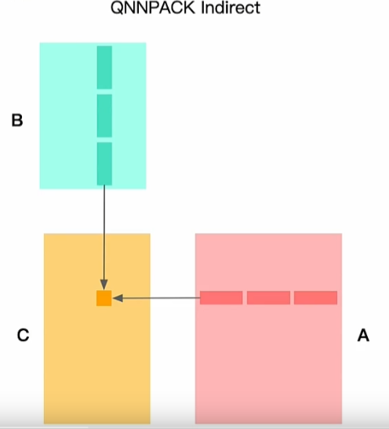

## 推理引擎 Kernel 优化

### Im2Col Optimizer Im2Col 优化算法

Im2col 是计算机视觉领域中将图片转换成矩阵的矩阵列（column）的计算过程

由于二维卷积的计算比较复杂，不易优化，因此在 AI 框架早期，Caffe 使用 Im2col方法将三维张量转换为二维矩阵，从而充分利用已经优化好的 GEMM 库来为各个平台加速卷积计算。最后，再将矩阵乘得到的二维矩阵结果使用Col2Im 转换为三维矩阵输出

Tensor（NHWC）-- Im2Col --> GEMM -- Col2Im--> Tensor(NHWC)

Im2Col + Matmul 方法主要包括两个步骤：

1. 使用 Im2col 将输入的高维矩阵展开为一个二维大矩阵，矩阵每一列表示卷积核需要的一个输入数据
2. 使用上面转换的矩阵进行 Matmul 运算，得到的数据就是最终卷积计算的结果

Img2col 是一种比较朴素的卷积优化算法，在没有精心处理的情况下会带来较大的内存开销。空间组合（Spatial pack）是一种类似矩阵乘中重组内存的优化算法

**空间组合优化算法**：是一种基于分治法（Divide and Conquer）的方法，基于空间特性，将卷积计算划分为若干份，分别处理

将输入的大Feature Map 根据卷积核Windows的大小和Stride，划分成 Unpack 层中多个小的 Feature Map，将小的Feature Map 和权重进行卷积得到多个数据输出。最后将多个输出组合成原始输出

划分过程中计算总量不变，但计算小矩阵时访存局部性更好，可以借由计算机存储层次结构获得性能提升

但是这种方式 padding 会引起额外的内存开销

### Winograd 算法

Winograd 算法已广泛应用于各种推理引擎中，其在卷积优化中的应用的基本方法和矩阵乘中应用类似，通过技巧性的矩阵计算变换，减少计算过程所需的乘法数量

conv计算过程中，往往 stride < kernel_size，所以最后转换的矩阵乘中往往有规律的分布着大量的重复元素，可以通过数学方法提取出可以复用的计算，从而加速整个卷积

Winograd 算法不推荐在单个小局部二维卷积中使用，产生的辅助矩阵规模过大，得不偿失
存储辅助矩阵带来额外的内存开销和瓶颈
Winograd 算法通过减少乘法次数来实现提速，但加法的数量会相应增加，同时需要额外的转换计算以及存储转换矩阵，随着卷积核和分块的尺寸增大，就需要考虑加法、转换计算和存储的代价，而且 tile 越大，转换矩阵越大，计算精度的损失会进一步增加，所以 Winograd 算法只适用于较小的卷积核和 tile

### QNNPack 间接优化算法

每个算子下面底层可能会对接多个 kernel，实际执行过程中，由runtime 决定具体执行哪个kernel，同一个算子在不同场景下可能会执行到不同的 kernel

QNNPACK（Quantized Neural Networks PACKage）是 Marat Dukhan（Facebook）开发的专门用于量化神经网络计算的加速库，其卓越的性能表现击败了几乎全部已公开的加速算法

在计算矩阵相乘时，传统的优化方法是在 K 维度上拆分，在一次计算 kernel 处理中，仅计算 K 维的局部。那么在每次计算 Kernel 的处理中，都会发生对输出的加载和存储

#### QNNPACK 算法思想

QNNPACK　做法是将整个 K 维全部计算在 Kernel 中处理完，消除了输出部分和的访存。这里所说的“将整个 K 维全部”并不是指 K 维不进行拆分，而是指拆分后不和其他维度交换，实际计算中 K 维会已 $ 2^n $ 为基础进行拆分

.

为了解决Im2col 占用大量额外的内存和需要对输入进行额外的数据拷贝的问题，间接卷积算法提出间接缓冲区（Indirect Buffer），对内存重新组织（Repacking）以改善高速缓存命中率，从而提高性能

#### Indirect Convolution Algorithm 工作流程

Indirect 算法在*输入缓冲区*基础上构建*间接缓冲区（Indirect Buffer），在网络运行时，每次从输入中取出一小块数据放入缓存区，并重新排布内存，缓冲区于kernel计算后放入结果矩阵，一直重复这个过程，直到计算完成

### 内存布局

## Nvidia GPU

## GPU 线程机制

一个GPU中有多个流处理器（Streaming Multiprocesssor，SM），每个SM中有多个 warp，warp是线程簇，每个warp 可以同时并行执行多个线程

GPU 的本质在于并行
CPU 则是尽可能加快指令的运算

## GPU 线程分级

在 AI 计算模式中，不是所有计算都是线程独立的

对一张图片，先用网格 Grip 进行覆盖，切分成多个块 Blocks（相邻 Block 可能会重叠），对每个块独立执行处理。Block 中线程 Threads 通过本地数据共享来计算

Nvidia 的 GPU 中有多个 GPC（Graph Process Cluster）图像处理簇（A100 中有8个）；每个GPC中有多个 TPC（Texture Process Cluster）纹理处理簇；每个 TPC 中有多个 SM；SM中有多个 Block 和 Thread

- GPC（Graph Processing Cluster）：图形处理簇
- TPC（Texture Processing Cluster）：纹理处理簇
- SM（Stream Multiprocessors）：流多处理器

GPC > TPC > SM > CORE（CUDA Tensor core、TR Core）

### SM 流式多处理器

核心组件包括 CUDA 核心、共享内存、寄存器等

- CUDA Core：向量运算单元（FP32-FPU、FP64-DPU、INT32-ALU）
- Tensor Core：张量运算单元（FP16、BF16、INT8、INT4）
- Special Function Units：特殊函数单元SFU（超越函数和数学函数，例如反平方根、正余弦）
- Warp Scheduler：线程束调度器（XX Thread/clock）
- Dispatch Unit：指令分发单元（XX Thread/clock）
- Multi level Catch：多级缓存
- Register File：寄存器堆
- Load/Store：访问存储单元 LD/ST

在 CUDA 中的作用：可以并发地执行数百个线程。

一个 block 上线程是放在同一个 SM，SM 的有限 Cache 制约了每个 block 的线程数量

### Warp 线程束

逻辑上，所有 Thread 是并行的，但是，从硬件的角度来说，并不是所有的 Thread 能够在同一时刻执行，这里就需要引入 Warp

通过 Warp 对线程进程锁同步，然后拆解成具体的指令给执行单元去执行

Warp 是 SM 基本执行单元，一个 Warp 包含 32 个并行 Thread，这 32 个 Thread 执行于 SIMT 模式。也就是所有 Thread 以锁同步的方式执行同一条指令，但每个 Thread 会使用各自的 Data 执行指令分支。如果在 Warp 中没有 32 个 Thread 需要工作，那么 War哦 还是作为一个整体运行，但这部分 Thread 是处于非激活状态的

### CUDA

CUDA（Compute Unified Device Architecture）通用并行计算平台和编程模型

是一个并行计算架构和编程模型或者说编程体系

基于 LLVM 构建了 CUDA 编译器，方便开发者使用 C 进程开发。提供了对其他编程语言的支持

CUDA 使软硬件解构，可以独立演进

### 线程层次结构：Kernel

CUDA 引入主机端（host）和设备（device）概念。CUDA程序中既包含 host 程序，又包含 device 程序

相互通信：host和device之间可以进行通信和数据的拷贝

- CUDA 执行流程中最重要的一个过程是调用 CUDA 的 kernel 函数来执行计算，kernel 是 CUDA 中一个重要的概念
- 在 CUDA 程序架构中，Host 代码部分在 CPU 上执行，是普通 C 代码；当遇到数据并行处理的部分，CUDA 就会将程序编译成 GPU 能执行的程序，并传送到 GPU上执行，这个程序在 CUDA 里称作 kernel
- Device 代码部分在 GPU 上执行，此代码部分编写在 kernel 函数中（.cu 文件）。kernel 用 `__global__` 符号声明，在调用时需要使用 `<<<grid, block>>>` 来指定 kernel 要执行

1. 网格 Grid
   - kernel 在 device 上执行时，实际上是启动很多线程，一个kernel所启动的所有线程称为一个网格 Grid
   - 同一个网格上的线程共享相同的全局内存空间
2. 线程块 Block
   - Grid 分为多个 Block，一个 block 里包含很多个线程，block 之间并行执行，并且无法通行，也就没有执行顺序。
   - 每个block 包含共享内存（shared Memory），里面的 Thread 共享这些内存
3. 线程 Thread
   - CUDA 并行程序实际上会被多个 thread 来执行
   - 同一个 block 中 thread 可以同步，也可以通过 Shared Memory 通信

CUDA 跟 NVIDIA 硬件架构的关系

线程块 Block 只在一个 SM 上通过 wrap 进行调度
一旦在 SM 上调起了 block 线程块，就会一直保留到执行完 kernel
SM　可以同时保存多个　Block，快速并行的执行

## Tensor Core

CUDA Core：

GPU 并行模式实现深度学习功能过于通用，最常见 Conv/GEMM 操作依旧要被编码成FMA，硬件层面还是需要把数据按：寄存器-ALU-寄存器-ALU-寄存器 方式来回搬运

Tensor Core：

V100 Tensor Core 提供可编程矩阵乘法和累加单元（matrix-multiple-and-accumulate units），可为AI训练和推理提供125 Tensor TFLOPS 算力。V100 包含 640 个 Tensor 内核：每个SM 8 个