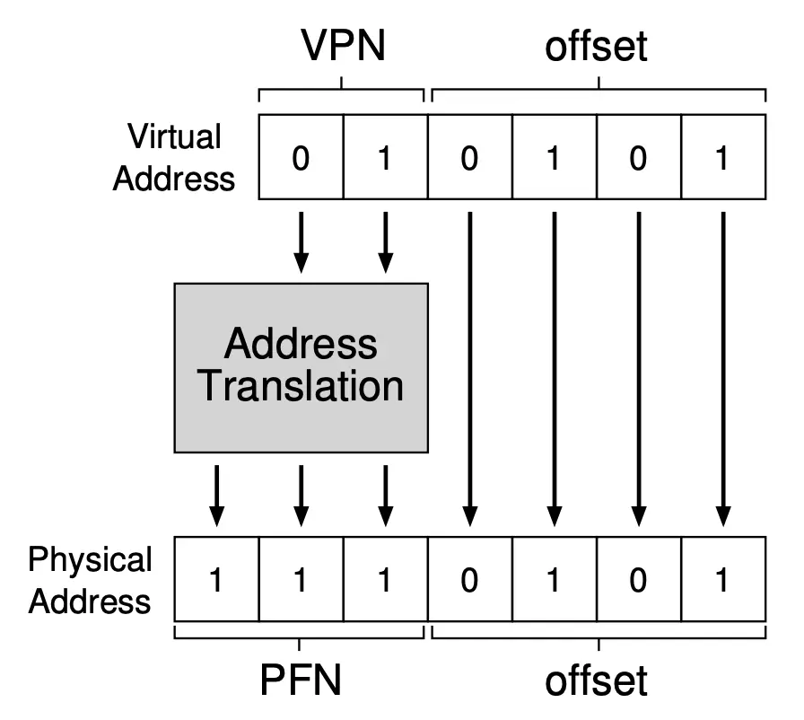

# 操作系统

## 并发

多处理器编程

并发控制：互斥

调试理论与实践

并发控制：同步

真实世界的并发编程

并发 bug

## 虚拟化

### 操作系统上的进程

#### 加载第一个进程

进程 = 状态机

C程序：多个栈帧的链表+全局变量

编译器：C状态机 -> 汇编状态机的翻译器

特殊的指令/函数：syscall

操作系统的启动：

- Firmware 阶段
  - CPU Reset后，Firmware 代码开始执行
  - 加载操作系统
- 操作系统初始化阶段
  - 操作系统扫描系统中的硬件、初始化数据结构。。
  - 加载第一个进程Init（状态机）
- 操作系统执行阶段
  - 状态机在 CPU 上执行
  - 允许执行 syscall 进入操作系统代码

最小 Linux: 我们完全可以构建一个 “只有一个文件” 的 Linux 系统——Linux 系统会首先加载一个 “init RAM Disk” 或 “init RAM FS”，在作系统最小初始化完成后，将控制权移交给 “第一个进程”。

恰恰是 UNIX “干净” 的设计 (完成初始化后将控制权移交给第一个进程) 使得 Linus 可以在可控的工程代价下实现 (相当完善的) POSIX 兼容，从而掀起一场操作系统的革命。时至今日，实现接口级的兼容已经是一件极为困难的工程问题，典型的例子是微软的工程师最终抛弃了 API 行为兼容的 Windows Subsystem for Linux 1.0，进而转向了虚拟机上运行的 Linux 内核。

整个 Linux 的 “世界” 都是从这个进程开始，并通过一系列实现进程管理的操作系统 API 创建的。

#### 创建新进程

```C
pid_t fork(void);
```

现在我们已经有 “一个状态机” 了

- 只需要 “创建状态机” 的 API 即可
- UNIX 的答案: fork
  - 做一份状态机完整的复制 (内存、寄存器现场)

理解 fork(): fork() 会完整复制状态机
包括**所有**信息的完整拷贝：每一个字节的内存、打开的文件（共享）
复制失败返回-1，errno会返回错误的原因

如何区分两个状态机：
新创建的状态机返回值为 0，执行 fork() 的进程会返回子进程的进程号。同时，操作系统中的进程是并行执行的。

进程总有“被创建”的关系，因此总能找到“父子关系”
因此有了进程树（pstree）

#### 运行可执行程序

```C
int execve(const char *filename, char * const argv[], char * const envp[]);
```

UNIX 的答案：execve（重置状态机）
将当前进程**重置**成一个可执行文件描述状态机的初始状态

execve 是唯一能够“执行程序”的系统调用，
因此也是一切进程 strace 的第一个系统调用

UNIX 中实现“创建新状态机”的方式

Spawn = fork + execve

```C
int pid = fork();
if (pid == -1) {
    perror("fork"); goto fail;
} else if (pid == 0) {
    // Child
    execve(...);
    perror("execve"); goto fail;
} else {
    // Parent
    ...
}
```

应用程序执行的环境

- 使用 env 命令查看
  - PATH: 可执行文件搜索路径
  - PWD: 当前路径
  - HOME: home 目录
  - DISPLAY: 图形输出
  - PS1: shell 的提示符
- export: 告诉 shell 在创建子进程时设置环境变量
  - 小技巧：export ARCH=x86_64-qemu 或 export ARCH=native

大部分情况下，创建的新进程继承环境变量

环境变量：PATH
可执行文件搜索路径

理解 execve: execve 有三个参数：path, argv, envp，分别是可执行文件的路径、传递给 main 函数的参数和环境变量。execve 是一个 “底层” 的系统调用，而 POISX 额外提供了 execl 等库函数便于我们使用。

#### 退出程序

状态机管理：销毁状态机

```C
void _exit(int status);
```

fork + exec = 自由执行任何程序

- 还差一个销毁状态机的函数就完整了
- UNIX 的答案: _exit
  - 立即摧毁状态机，允许有一个返回值
- 子进程终止会通知父进程 (后续课程解释)

多线程程序怎么办？

理解 exit: 除了 libc 为我们提供的 exit 函数之外，Linux 提供了两个系统调用：exit 和 exit_group，它们可以在 syscalls(2) 的手册中看到。同时，你也可以在这份手册中看到 Linux 肩负的 “历史包袱”。strace 可以查看应用程序是如何 “退出” 的。

因为 “程序 = 状态机”，操作系统上进程 (运行的程序) 管理的 API 很自然地就是状态机的管理。在 UNIX/Linux 世界中，以下三个系统调用创建了整个 “进程世界”，不论是我们常用的 IDE 和浏览器，还是编译时在后台调用的 gcc。其中，fork 对当前状态机状态进行完整复制，execve 将当前状态机状态重置为某个可执行文件描述的状态机，exit: 销毁当前状态机。在对这个概念有了绝对正确且绝对严谨的理解后，操作系统也就显得不那么神秘了。

### 进程的地址空间

进程的状态机模型

- 进程状态 = 内存 + 寄存器
- 到底什么是 “进程的内存”？

进程的地址空间
RTFM：`/prof/[pid]/maps`（man 5 proc）

- 进程地址空间中的每一段
  - 地址（范围）和权限（rwxsp）
  - 对应的文件：offset、dev、inode、pathname
    - TFM 里有更详细的解释
  - 和 readelf(-l) 里的信息互相验证

状态机的视角

- 地址空间 = 带访问权限的内存段
  - 不存在（不可访问）
  - 存在（可读/写/执行）
- 管理 = 增加/删除/修改一段可访问的内存

memory map 系统调用

在状态机状态上增加/删除/修改一段可访问的内存

- MAP_ANONYMOUS: 匿名 (申请) 内存
- fd: 把文件 “搬到” 进程地址空间中 (例子：加载器)
- 更多的行为请参考手册 (复杂性暴增)

```C
// 映射
void *mmap(void *addr, size_t length, int prot, int flags, int fd, off_t offset);
int munmap(void *addr, size_t length);

// 修改映射权限
int mprotect(void *addr, size_t length, int prot);
```

Example 1: 申请大量内存空间

- 瞬间完成内存分配
  - mmap/munmap 为 malloc/free 提供了机制
  - libc 的大 malloc 会直接调用一次 mmap 实现
- 不妨 strace/gdb 看一下

Example 2: Everything is a file

- 映射大文件、只访问其中的一小部分

```C
with open('/dev/sda', 'rb') as fp:
    mm = mmap.mmap(fp.fileno(), prot=mmap.PROT_READ, length=128 << 30)
    hexdump.hexdump(mm[:512])
```

mmap: Linux 系统使用 anonymous 的 mmap 来实现大段连续内存的分配——甚至在系统调用返回的瞬间，进程可以没有得到任何实际的内存，而是只要在首次访问时 (触发缺页异常) 分配即可。AddressSanitizer 就用 mmap 分配了 shadow memory，我们可以使用 strace 观察到这一点。

入侵进程地址空间

- 调试器（gdb）
  - gdb 可以任意观测和修改程序的状态
- Profiler（perf）
  - M3 中借助它理解程序的性能瓶颈

状态机的视角自然地将我们引入 “内存到底是什么” 的问题——它的答案同样也很自然：带有访问权限控制的连续内存段。我们可以通过 mmap、munmap、mprotect 三个系统调用调整状态机的地址空间，包括分配匿名的内存、映射文件内容到内存、修改访问权限等。更有趣的是操作系统有 “能够实现一切应用程序” 的需求，调试器也不在话下——这也给了我们入侵其他进程地址空间的机制。

### 系统调用和 UNIX Shell

#### 更多的操作系统 API

操作系统对象：文件和设备

访问操作系统中的对象

文件：有“名字”的对象
字节流（终端）或字节序列（普通文件；包括 /prof/*）

文件描述符

- **指向操作系统对象的“指针”**
  - Everything is a file
  - 通过指针可以访问“一切”
- 对象的访问都需要指针
  - open、close、read/write（解引用）、lseek（指针内赋值/运算）、dup（指针间赋值）

Windows 中的文件描述符

Handle（把手）

- 比 file descriptor 更像“指针”
- 你有一个 “handle” 在我手上，我就可以更好地控制你

文件描述符：文件描述符是一个用于访问文件或其他输入/输出资源的 “指针”。在 Unix 和类 Unix 操作系统中，文件描述符是一个非负整数，用于表示一个打开的文件、管道、网络连接或其他类似的资源。当一个程序打开一个文件或创建一个数据流时，操作系统会返回一个文件描述符，程序可以通过这个描述符来读取、写入或操作对应的文件或资源。

管道：一个特殊的 “文件” (流)

- 由读者/写者共享
  - 读口：支持 read
  - 写口：支持 write

```C
#include <stdio.h>
#include <stdlib.h>
#include <string.h>
#include <fcntl.h>
#include <sys/stat.h>
#include <unistd.h>
#include <errno.h>

// We also have UNIX domain sockets for local inter-process
// communication--they also have a name in the file system
// like "/var/run/docker.sock". This is similar to a named
// pipe.
#define PIPE_NAME "/tmp/my_pipe"

void pipe_read() {
    int fd = open(PIPE_NAME, O_RDONLY);
    char buffer[1024];

    if (fd == -1) {
        perror("open");
        exit(1);
    }

    // Read from the pipe
    int num_read = read(fd, buffer, sizeof(buffer));
    if (num_read > 0) {
        printf("Received: %s\n", buffer);
    } else {
        printf("No data received.\n");
    }
    close(fd);
}

void pipe_write(const char *content) {
    // Open the pipe for writing
    int fd = open(PIPE_NAME, O_WRONLY);

    if (fd == -1) {
        perror("open");
        exit(1);
    }

    // Write the message to the pipe
    write(fd, content, strlen(content) + 1);
    close(fd);
}

int main(int argc, char *argv[]) {
    if (argc < 2) {
        fprintf(stderr, "Usage: %s read|write [message]\n", argv[0]);
        return 1;
    }

    // Create the named pipe if it does not exist
    if (mkfifo(PIPE_NAME, 0666) == -1) {
        if (errno != EEXIST) {
            perror("mkfifo");
            return 1;
        }
    } else {
        printf("Created " PIPE_NAME "\n");
    }

    if (strcmp(argv[1], "read") == 0) {
        pipe_read();
    } else if (strcmp(argv[1], "write") == 0) {
        pipe_write(argv[2]);
    } else {
        fprintf(stderr, "Invalid command. Use 'read' or 'write'.\n");
        return 1;
    }

    return 0;
}

```

匿名管道

```C
int pipe(int pipefd[2]);
```

- 返回两个文件描述符
- 进程同时拥有读口和写口
  - 看起来没用？不，fork 就有用了

```C
#include <stdio.h>
#include <stdlib.h>
#include <unistd.h>
#include <string.h>
#include <sys/wait.h>

void do_parent(int fd) {
    const char *msg = "Hello, world!";

    printf("[%d] Write: '%s'\n", getpid(), msg);
    write(fd, msg, strlen(msg) + 1);

    close(fd);

    // Wait for the child to finish
    wait(NULL);

    printf("[%d] Done.\n", getpid());
}

void do_child(int fd) {
    static char buf[1024];

    ssize_t num_read = read(fd, buf, sizeof(buf));
    if (num_read == -1) {
        perror("read");
        exit(EXIT_FAILURE);
    }

    printf("[%d] Got: '%s'\n", getpid(), buf);

    // Close the read end of the pipe
    close(fd);
}

int main() {
    int pipefd[2];

    // Create a pipe
    if (pipe(pipefd) == -1) {
        perror("pipe");
        exit(EXIT_FAILURE);
    }

    // Fork the current process
    pid_t pid = fork();
    if (pid == -1) {
        perror("fork");
        exit(EXIT_FAILURE);
    }

    if (pid == 0) {
        // Child
        close(pipefd[1]); // Close unused write end
        do_child(pipefd[0]);
    } else {
        // Parent
        close(pipefd[0]); // Close unused read end
        do_parent(pipefd[1]);
    }

    return 0;
}
```

- pipe read 在没有数据时会等待
- pipe write 在有读者打开时，会写入操作系统的缓冲区并返回

- pipe write() 的原子性
  - write 如果“不太多”，一对 write-read 是原子的
  - write 如果超过 PIPE_BUF，可能会被拆成多份

如果 read 方关闭管道，write 会收到 SIGPIPE 信号（Broken Pipe）

UNIX 管道：UNIX 管道 (pipe) 是一种典型的进程间通信机制，允许数据在不同的进程之间单向流动。管道可以被视为一种特殊的文件，其中一个进程将数据写入管道的一端，而另一个进程从另一端读取数据。

操作系统 = 对象 + API

#### Shell：Kernel 的“外壳”

The UNIX shell

- “终端”时代的伟大设计：“Command-line interface”（CLI）

UNIX Shell：“把用户指令翻译成系统调用”的编程语言
“搭建一个临时工具组合”

The Shell Programming Language

基于文本替换的快速工作流搭建

- 重定向: cmd > file < file 2> /dev/null
- 顺序结构: cmd1; cmd2, cmd1 && cmd2, cmd1 || cmd2
- 管道: cmd1 | cmd2
- 预处理: $(), <()
- 变量/环境变量、控制流……

Job control

- 类比窗口管理器里的 “叉”、“最小化”
  - jobs, fg, bg, wait
  - (今天的 GUI 并没有比 CLI 多做太多事)

UNIX 世界的全部机制

- 进程管理
  - fork, execve, exit
- 内存管理
  - mmap, munmap, mprotect
- 文件管理
  - open, close, read, write, lseek, dup
- 进程间通信
  - pipe, wait

### C标准库和实现

#### The C Standard Library

C 语言：世界上 “最通用” 的高级语言

- C 是一种 “高级汇编语言”
  - AskGPT: 为什么称 C 语言是高级的汇编语言？
  - 作为对比，C++ 更好用，但也更难移植
- 系统调用的一层 “浅封装”

语言机制上的运行库

- 大部分可以用 C 语言本身实现
- 少部分需要一些“底层支持”
  - 体系结构相关的内联汇编

库也被标准化

- ISO IEC 标准的一部分
- POSIX C Library 的子集
  - 稳定、可靠
  - 极佳的移植性

[musl libc](https://musl.libc.org/)

#### 基础编程机制的抽象

- [stddef.h](https://cplusplus.com/reference/cstddef/) - size_t
  - 还有一个有趣的 “offsetof” (Demo; 遍历手册的乐趣)
- [stdint.h](https://cplusplus.com/reference/cstdint/) - int32_t, uint64_t
- [stdbool.h](https://cplusplus.com/reference/cstdbool/) - bool, true, false
- [float.h](https://cplusplus.com/reference/cfloat/)
- [limits.h](https://cplusplus.com/reference/climits/)
- [stdarg.h](https://cplusplus.com/reference/cstdarg/)
- [inttypes.h](https://cplusplus.com/reference/cinttypes/)
  - 打印 intptr_t 变量 printf 的格式字符串是什么？
- [string.h](https://cplusplus.com/reference/cstring/): 字符串/数组操作
  - memcpy, memmove, strcpy, ...
- [stdlib.h](https://cplusplus.com/reference/cstdlib/): 常用功能
  - rand, abort, atexit, system, atoi, ...

#### 系统调用与环境的抽象

输入/输出

Standard I/O: stdio.h

- FILE * 背后其实是一个文件描述符
- 我们可以用 gdb 查看具体的 FILE *
  - 例如 stdout
- 封装了文件描述符上的系统调用 (fseek, fgetpos, ftell, feof, ...)

The printf() family

- 这些代码理应没有 “code clones”

err, error, perror
所有 API 都可能失败

errno 是 thread local 线程本地的

environ (7)

```C
int main(argc, char *argv[], char *envp[]);
```

envp: execve() 传递给进程的 “环境”

第一个指令 _start：

```x86asm
xor %rbp,%rbp 清零 rbp
mov %rsp,%rdi 将当前栈顶（rsp）给第一个参数（rdi）
lea -0x401045(%rip),rsi 将某个常量给第二个参数（rsi）
and $0xffffffffff0,%rsp
call <_start_c>
```

操作系统准备好第一个栈（初始状态）

```C
// musl 实现
void _start_c(long *p)
{
    int argc = p[0];
    char **argv = (void *)(p+1);
    __libc_start_main(main, argc, argv, _init, _finish);
}

int __libc_start_main(int (*main)(int,char **,char **), int argc, char **argv,
   void (*init_dummy)(), void(*fini_dummy)(), void(*ldso_dummy)())
{
    char **envp = argv+argc+1;
    __init_libc(envp, argv[0]);
    lsm2_fn *stage2 = libc_start_main_stage2;
    __asm__ ( "" : "+r"(stage2) : : "memory" );
    return stage2(main, argc, argv);
}

static int libc_start_main_stage2(int (*main)(int,char **,char **), int argc, char **argv)
{
    char **envp = argv+argc+1;
    __libc_start_init();

    /* Pass control to the application */
    exit(main(argc, argv, envp));
    return 0;
}
```

RTFM: System V ABI p33
Figure 3.9 Initial Process Stack
操作系统有一个 “初始状态”
libc 调用 main 前还会继续初始化这个 “初始状态”


操作系统只要将初始堆栈按照规定放置，就能调用 libc

#### 动态内存管理

大段内存，要多少有多少
用 MAP_ANONYMOUS 申请，想多少就有多少
超过物理内存上限都行 (Demo)
反而，操作系统不支持分配一小段内存
这是应用程序自己的事
malloc() 和 free()
Specification 很简单：Lab1
在大区间 [L,R) 中维护互不相交的区间的集合
麻烦：多线程安全和 scalability

mmap: Linux 系统使用 anonymous 的 mmap 来实现大段连续内存的分配——甚至在系统调用返回的瞬间，进程可以没有得到任何实际的内存，而是只要在首次访问时 (触发缺页异常) 分配即可。AddressSanitizer 就用 mmap 分配了 shadow memory，我们可以使用 strace 观察到这一点。

### Linux 操作系统

#### 启动 Linux

Initial RAM FS 创建 “第一个世界”

Linux 系统更新

- update-initramfs... (漫长的等待)
- 就是 Linux Kernel 启动后的 “第一个世界”
  - 把控制权交一个拥有高权限的用户程序
  - 这是一切的起点
  - 使用 df 命令：没有 “文件系统”！

我们也可以控制它

- 一个 Makefile 就能办到
- 启动后，还多了一个 /dev/console (但不是 tty)

[Busybox](https://www.busybox.net/)

逐层构建的抽象

硬件 (ISA) → 操作系统对象/系统调用 → libc → 系统工具 (coretuils, busybox, ...) → 应用程序 (xfce, vscode)

最小 Linux: 我们可以在 initramfs 中放置任意的数据——包括应用程序、内核模块 (驱动)、数据、脚本……操作系统世界已经开始运转；但直到执行 pivot_root，才真正开始 今天 Linux 应用世界 (systemd) 的启动。

#### 构建应用程序的世界

Initramfs: 并不是我们实际看到的 Linux

启动的初级阶段

- 加载剩余必要的驱动程序，例如磁盘/网卡
- 挂载必要的文件系统
- 将根文件系统和控制权移交给另一个程序，例如 systemd

启动的第二级阶段

- 看一看系统里的 /sbin/init 是什么？
- 计算机系统没有魔法 (一切都有合适的解释)
  - pstree 埋下的伏笔得到解答

构建 “真正” 应用世界的系统调用

switch_root 命令背后的系统调用

```C
int pivot_root(const char *new_root, const char *put_old);
```

- `pivot_root()` changes the root mount in the mount namespace of the calling process. More precisely, it moves the root mount to the directory `put_old` and makes `new_root` the new root mount. The calling process must have the `CAP_SYS_ADMIN` capability in the user namespace that owns the caller's mount namespace.
- syscalls(2)

/etc/fstab

systemd 通过 mount 系统调用配置文件系统

- systemd: “system and service manager”, “provides a dependency system between units”

File System Table: 每行一个文件系统

- 设备：/dev/sda1, UUID=XXXX
- 挂载点 (mount point): /, /home, ...
- 文件系统类型: ext4, vfat, ...
- 挂载选项: ro, rw, ...
- Dump/pass: 备份/检查标记

创建一个磁盘镜像

- /sbin/init 指向任何一个程序
  - 同样需要加载必要的驱动
  - 例子：pivot_root 之后才加载网卡驱动、配置 IP
  - 例子：tty 字体变化
    - 这些都是 systemd 的工作
- 例子：NOILinux Lite

Initramfs 会被释放，功成身退

我们从 CPU Reset 后的 “硬件初始状态” 到操作系统加载完 init 进程后的 “软件初始状态”，从此以后，计算机系统中的一切都是由应用程序主导的，操作系统只是提供系统调用这一服务接口。正是系统调用 (包括操作系统中的对象) 这个稳定的、向后兼容的接口随着历史演化和积累，形成了难以逾越的技术屏障，在颠覆性的技术革新到来之前，另起炉灶都是非常困难的。

### 可执行文件和加载

#### 可执行文件

一个操作系统中的对象
一个字节序列
一个描述了状态机初始状态的**数据结构**

执行完 execve 后，操作系统被要求在内存中按照规定初始状态（第一个栈）
这块内存被 rsp 指向

进程的初始状态包括 内存+寄存器

System V ABI

- Section 3.4: Process Initialization
  - 只规定了部分寄存器和栈
  - 其他状态（主要是内存）由**可执行文件**指定

ELF: Executable and Linkable Format

- binutils 中的工具可以让我们查看其中的重要信息
- 《计算机系统基础》常备工具 readelf & objdump

可执行文件定义了 execve 加载可执行文件后内存的状态
可执行文件就是一个数据结构，它描述了 execve 执行后地址空间中应该有什么

UNIX a.out "assembler output"

- 一个相对平坦的数据结构

```C
struct exec {
    uint32_t a_midmag;  // Machine ID & Magic
    uint32_t a_text;    // Text segment size
    uint32_t a_data;    // Data segment size
    uint32_t a_bss;     // BSS segment size
    uint32_t a_syms;    // Symbol table size
    uint32_t a_entry;   // Entry point
    uint32_t a_trsize;  // Text reloc table size
    uint32_t a_drsize;  // Data reloc table size
}
```

将数据搬到内存中指定位置，并将 PC 指针指向 entry 位置，程序就可以执行

功能太少（不支持动态链接、调试信息、内存对齐、thread-local），自然被淘汰

生成可执行文件

#### 预编译 & 编译

源代码（.c）->源代码（.i）

- Ctrl-C & Ctrl-V（#include）
- 字符串替换
- 过程宏

源代码（.i）->汇编代码（.s）

- “高级状态机”到“低级状态机”的翻译
- 最终生成带标注的指令序列

#### 汇编

汇编代码（.s）->目标文件（.o）

- 文件 = section（.text, .data, .rodata.str.1, ...）
  - 对于 ELF，每个 section 有它的权限、内存对齐等信息
- section 中的三要素
  - **代码**（字节序列）
  - **符号**：标记“当前”的位置
  - **重定位**：暂时不能确定的数值（链接时确定）
    - ELF 中全局和局部符号有什么区别？还有其他类型的符号吗？

#### （静态）链接

多个目标文件（.o）->可执行文件（a.out）

- 合并所有的 section
  - 分别合并 .text, .data, .bss 中的代码
  - 把 section “平铺”成字节序列
  - 确定所有符号的位置
  - 解析全部重定位
- 得到一个**可执行文件**
  - 程序初始内存状态的描述

#### 加载

把“字节序列”搬到内存

然后设置正确的 PC，开始运行

```C
mem = mmap.mmap(
    fileno=-1, length=len(bs),
    prot=mmap.PROT_READ | mmap.PROT_WRITE | mmap.PROT_EXEC,
    flags=mmap.MAP_PRIVATE | mmap.MAP_ANONYMOUS,
)
mem.write(bs)
mem.flush()
call_pointer(mem, fle['symbols']['_start'])
```

UNIX 对 # 注释的 “妙用”

- file.bin:

```
#!A B C
```

操作系统会执行 execve(A, ["A", "B C", "file.bin"], envp)

#### 加载 ELF 文件

- 将多段字节序列复制到地址空间中
  - 分别赋予可读/可写/可执行权限
- 然后跳转到指定的 entry (默认为 _start) 执行

- ELF 是 “二进制数据结构”
- readelf -l 描述了如何加载它
  - Offset: segment 在文件中的偏移量
  - VirtAddr: 段在内存中应当被加载到的起始地址
  - PhysAddr (一般不用)
  - FileSiz: 段在文件中的字节数
  - MemSiz: 段在内存中的字节数 (可能大于文件大小)
  - Flags: 权限，例如 RWE
  - Align: 虚拟地址的对齐

实现 my_execve(): 问题分析

- 得到 ELF 文件中的数据结构描述
- 按照 “要求” 执行 mmap 系统调用
- 创建 Initial Process Stack
  - 再一次，System V ABI
- 构成进程初始状态
  - 理论上我们可以实现 “没有 execve 的 execve”
  - my_execve() 在其他地方也有：AbstractMachine

静态 ELF 加载器: Linux 操作系统可以直接使用 execve 系统调用加载一个程序，实现状态机的 “重置”；同时，我们也可以自己动手模拟 execve 系统调用的行为：将 ELF 文件中需要加载的部分映射到内存，并根据 ABI 构建正确的进程初始栈和寄存器，我们就能实现二进制文件的 “加载”。

可执行文件是一个描述状态机初始状态的数据结构 (字节序列)；加载器就是把这个 “初始状态” 搬运到操作系统中的程序。用数据结构的眼光看可执行文件，就不难发现它不好阅读的原因：它的设计者并没有打算让你阅读它。这样的难题在《操作系统》课程中经常出现；而我们的应对方法是先理解一个粗糙但重要的模型，然后在此基础上理解工业级实现面临的挑战和问题。

#### 动态链接

“拆解应用程序”的需求

实现运行库和应用代码分离

- 应用之间的库共享
  - 每个程序都需要 glibc
  - 但系统里只需要一个副本就可以了
    - 是的，我们可以用 ldd 命令查看
- 大型项目的分解
  - 改一行代码不用重新链接 2GB 的文件
  - libjvm.so, libart.so, ...
    - NEMU: “把 CPU 插上主板”

实现应用程序的拆解

方案 1: libc.o

- 在加载时完成重定位
  - 加载 = 静态链接
  - 省了磁盘空间，但没省内存
  - 致命缺点：时间 (链接需要解析很多不会用到的符号)

方案 2: libc.so (shared object)

- 编译器生成位置无关代码
  - 加载 = mmap
  - 但函数调用时需要额外一次查表
- 好处：多个进程映射同一个 libc.so，内存中只需要一个副本

地址空间表面是 “若干连续的内存段”

- 通过 mmap/munmap/mprotect 维护
- 实际是分页机制维护的 “假像”

#### 实现动态加载

动态加载：A Layer of Indirection

编译时，动态链接库调用 = 查表

> call  *TABLE[printf@symtab]

链接时，收集所有符号，“生成” 符号信息和相关代码：

```C
#define foo@symtab     1
#define printf@symtab  2
...

void *TABLE[N_SYMBOLS];

void load(struct loader *ld) {
    TABLE[foo@symtab] = ld->resolve("foo");
    TABLE[foo@printf] = ld->resolve("printf");
    ...
}
```

历史遗留问题：先编译、后链接

编译器的选择 1: 全部查表跳转

ff 25 00 00 00 00   call *FOO_OFFSET(%rip)

调用个 foo 都多查一次表，性能我不能忍 ❌

编译器的选择 2: 全部直接跳转

e8 00 00 00 00      call <reloc>

%rip: 00005559892b7000
libc.so.6: 00007fdcdf800000
相差了 2a8356549000
4-byte 立即数放不下，无论如何也跳不过去(32 位的偏移不够)

为了性能，“全部直接跳转” 是唯一选择

e8 00 00 00 00      call <reloc>

如果这个符号在链接时发现是 printf (来自动态加载)，就在 a.out 里 “合成” 一段小代码：

printf@plt:
    jmp *PRINTF_OFFSET(%rip)

我们发明了 PLT (Procedure Linkage Table)！

#### ELF 的动态链接和加载

实现数据的动态加载和链接

- main (.o) 访问 stderr (libc.so)
- libjvm (.so) 访问 stderr (libc.so)
- libjvm (.so) 访问 heap (libjvm.so)
  - 编译时同样不知道数据在哪里

与代码同样的难题：到底是什么符号？
extern int x;
是在同一个二进制文件 (链接时确定)？还是在另一个库中？

PLT: 没能解决数据的问题
对于数据，我们不能 “间接跳转”！

- x = 1, 同一个 .so (或 executable)

> mov $1, offset_of_x(%rip)

- x = 1, 另一个 .so

```
mov GOT[x], %rdi
mov $1, (%rdi)
```

不优雅的解决方法

- -fPIC 默认会为所有 extern 数据增加一层间接访问
  - __attribute__((visibility("hidden")))

找到正确的思路，我们就能在复杂的机制中找到主干：在动态链接的例子里，我们试着自己实现动态链接和加载——在这个过程中，我们 “发明” 了 ELF 中的重要概念，例如 Global Offset Table, Procedure Linkage Table 等。

动态加载、GOT 和 PLT

动态链接和加载解决的两个大问题

```C
void foo(); ... foo();
extern int x; ... x = 1;
```

编译时不知道 foo 是在同一链接单元（其他源文件）中，还是其他动态库中

- foo 和 x 的位置都可能在**加载**时确定
  - 因此需要一个 GOT[·]
  - foo: 二级跳转
    - call foo@plt → call *GOT[foo] (动态链接库)
    - call foo (同一链接单元)
  - x (stderr): 比想象中麻烦
    - -fPIE: *x(%rip) = 1; -fPIC: **x(%rip)
    - 依然可以访问共享库中的 x (这是如何做到的 😂)

动态链接相关的命令行工具

可执行文件仍然是 “状态机初始状态”

- 我们应该有工具可以查看它
- ldd - Print shared object dependencies
  - SEE ALSO 一直是手册里的宝藏：ld.so (8)

LD_LIBRARY_PATH：动态库搜索路径

学习方法与建议

- ATFAI: 从此单纯的 “知识” 不再是壁垒和禁区
- 对于一个动态链接的二进制文件，execve 后的第一条指令在哪里？
如何编译出一个不使用默认 ld.so 作为 interpreter 的 ELF 动态链接可执行文件？

动态加载器的实现

满足可执行文件提出的 “要求”

1. 把所有直接/间接依赖的库都映射到内存 (.dynamic)
2. 填入 GOT 表项 (.rela.dyn, .rela.plt)
   - PLT 可以延迟绑定 (lazy binding)
   - 但似乎现在也不延迟绑定了

加载器也提供了 “随时可用” 的版本

```C
void *dlopen(const char *filename, int flags);
void *dlsym(void *handle, const char *symbol);
```

如果能链接我们 “修改” 过的 libc 就好了

- 比游戏修改器更优雅的 “入侵” 地址空间方法
- 程序会主动把控制流交给我们

LD_PRELOAD: 在加载之前 preload

- 甚至我们都不需要修改 libc
- 动态加载的全局符号：**先到先得**

## 内核

### 系统调用、中断和上下文切换

#### syscall 指令

系统调用：向操作系统的 “函数调用”
syscall: “跳转并获得无限的权力”

```
call  printf@plt  // PLT; dynamic linked
call  pmm_alloc   // locally linked

syscall = “jal”:  // sysret: 逆操作
    mov %rip, %rcx  // 将下一条指令的地址（rip）保存到 rcx 寄存器中
    mov %rflags, %r11 // 将 rflags 保存到 r11
    set SS = kernel, CS = kernel, CPL = 0
    jmp IA32_LSTAR  // System Target Address Register

```


syscall 之后

CPU: 我只是无情的执行指令的机器

```C
while (true) {
    inst = fetch();
    decode(&decode_state, inst);
    exec(&decode_state);
}
```

- 此时 RIP = IA32_LSTAR, CPL = 0
- 操作系统可以配置 IA32_LSTAR
  - setjmp() → 在另一个栈中执行 → longjmp() → sysret
  - 执行时可以直接访问 I/O 设备和内核数据结构
  - **操作系统 = C 程序**

一些细节

- 进程的地址空间是虚拟的，进程的内存被 “拆散”，并且被 Page Table 重组了

> inst = fetch();

- 从 M[LSTAR] 的虚拟地址处取指令

操作系统内核：配置内存映射

- 低配版 (0): 内核在0地址的物理内存，只使用分段代码和数据是两个连续的物理内存 (Linux 1.x; like Minix)
- 低配版 (1): 内核还是在物理内存的低位（0地址），但在进程中会映射到 0xc0000000 (Linux 2.x)
- 今天：[Complete kernel virtual memory map](https://www.kernel.org/doc/html/v6.3/x86/x86_64/mm.html)

调试 syscall

Everything is a state machine
QEMU 本身就是一个状态机模拟器
在一条 syscall 上打一个断点（一个确定的地址上有1条syscall指令，静态链接）
观察寄存器/内存的变化

处理器的中断行为

如果处理器中断打开

- x86 Family（CISC的历史遗迹）
  - 询问中断控制器获得中断号 n
  - 保存 CS, EIP, EFLAGS, SS, ESP 到堆栈
  - 跳转到 IDT[n] 中的“Gate”
    - 一个描述带权限切换长跳转的数据结构
- RISC-V（M-Mode，Direct Exception Mode）
  - 检查 mie 是否屏蔽此次中断
  - 跳转 `PC = (mtvec & ~0xf)`
  - 更新 `mcause.Interrupt = 1`

另一种理解中断的方式：强制“插入”的syscall

- 中断
  - 保存 `mepc = PC`
  - 跳转 `PC = (mtvec & ~0xf)`
  - 更新 `mcause.Interrupt = 1`
- 系统调用（ecall）
  - 保存 `mepc = PC`
  - 跳转 `PC = (mtvec & ~0xf)`
  - 更新 `mcause.Ecall = 1`
- 无论现在在做什么，都去执行一下操作系统内核的代码

中断：奠定操作系统“霸主地位”的机制

操作系统内核（代码）想开就开，想关就关

应用程序不可以关中断，无论什么代码都会被打断

中断中操作系统应该做

- mov (kernel_rsp), %rsp
  - 这将是致命的
  - 进程（状态机）的状态就永远丢失了
- 首先：封存状态机（寄存器）
  - 内存由数据结构控制
- 然后：执行操作系统代码
  - C 代码可以任意使用寄存器
  - 操作系统代码选择一个封存的状态机返回
  - 恢复寄存器状态，执行 sysret(iret)

### 虚拟内存与分页机制

进程的实现

操作系统看到的内存和进程看到的不同

进程=戴上VR眼镜的线程

一个函数 𝑓
使所有对内存地址 x 的访问都转换为 𝑓(𝑥)



1. 规定好 𝑓 的描述方法

```C
struct page_table_entry {
    uint32_t vpn, ppn, flags; // valid & protection
} page_table[16];
```

1. 提供一条 “戴上 VR 眼镜” 的指令

```C
void arm_with_vr(page_table *pt) {
    asm volatile(
        "set_ptbr %0" : : "r"(pt) : "memory"
    );
}
```

将 $0~2^n-1$ 映射到另一个 $0~2^n-1$
f (内存部分): Radix Tree

- 一个 1024 叉树 (64-bit: 512 叉)
  - i386: 2 层，正好 10 + 10 + 12
  - x86_64: PML4/PML5
    - 也有三级页表 (sv39，索引 512 GB)

𝑓 (处理器部分): CR3 (PDBR)

> struct page *cr3;  // 指向数据结构根的指针

- Translation-Lookaside Buffer (TLB): 缓存

## 持久化

### 文件和设备驱动

我们可以把设备想象成一组寄存器，以及寄存器基础上的一个设备通信协议，能够实现处理器和设备之间的数据交换：数据可以小到一个字符 (串口)，也可以大到程序和海量的数据 (GPU)。

很自然的问题是，如果操作系统上的程序想要访问设备，就必须把设备抽象成一个进程可以使用系统调用访问的操作系统对象。于是我们就回到了 “文件” 和文件在操作系统中的实现。

#### 文件和文件描述符

Everything is a file

- 文件：有“名字”的对象
- 字节流（终端）或字节序列（普通文件；包括/prof/*）

文件描述符

- 指向操作系统对象的“指针”
  - 通过指针可以访问“everything”
- 对象的访问都需要指针
  - open, close, read/write (解引用), lseek (指针内赋值/运算), dup (指针间赋值)

应用程序通过系统调用访问文件

- open, read, write, mmap, ...

真的是这样吗？

- 求证：strace readelf -h /bin/ls

```
openat(AT_FDCWD, "/bin/ls", O_RDONLY) = 3
newfstat()
read(3, , 4096) = 4096
lseek()
read()
close()
```

- 还有更多有趣的例子
  - LC_ALL=zh_CN.UTF-8 strace readelf -h a.txt
  - “不是 ELF 文件 - 它开头的 magic 字节错”？
    - (需要 language-pack-zh-hans)

更多的细节

文件是“虚拟磁盘”，把磁盘的一部分映射到地址空间

> mmap(addr, length, prot, flags, fd, offset);

一些细节问题

- 映射的长度超过文件大小会发生什么？
  - RTFM 看来还是有用的 (“Errors”): SIGBUS
    - ftruncate 可以改变文件大小

文件访问的 offset

- 文件的读写自带“游标”
  - 省去了进程保存文件读/写的位置
- read/write: 会自动维护 offset
- lseek: 修改 offset 位置
  - 对比：mmap file，实现 append 是个噩梦

mmap, lseek, ftruncate 互相交互的情况

- 假设初始时文件大小为 2MB
  - lseek to 3 MiB (SEEK_SET)
    - 这时候能写入吗？（能，中间填0）
  - ftruncate to 1 MiB
    - 这时候 offset 在哪里？（改变文件大小，但不改变 offset，这是读取会返回 EOF，写入会扩展文件大小）

文件描述符在 fork 时会被子进程继承

- 父子进程共用 offset？√
- 父子进程拥有独立 offset？（父子进程同时写一个日志文件，不进行同步的话，会相互覆盖）

文件描述符会指向一个公用的数据结构，fork 时进行浅拷贝

操作系统的每一个 API 都可能和其他 API 有交互

1. open 时，获得一个独立的 offset
2. dup 时，两个文件描述符共享 offset
3. fork 时，父子进程共享 offset
4. execve 时文件描述符不变（O_CLOEXEC，在execve时自动关闭，以防止被泄漏给子进程）
5. O_APPEND 打开，偏移量永远在最后 (无论是否 fork)
   - modification of the file offset and the write operation are performed as a single atomic step

#### 文件的实现

文件描述符可以访问 “一切”，操作系统内核是如何实现的？
一个 switch-case

xv6-riscv: 由 Russ Cox、Frans Kaashoek、Robert Morris 共同实现的现代教学 UNIX 操作系统。参考资料：[xv6: a simple, Unix-like teaching operating system](https://pdos.csail.mit.edu/6.828/xv6)。

```C
if(f->type == FD_PIPE){ // 管道
  r = piperead(f->pipe, addr, n);
} else if(f->type == FD_DEVICE){ // 设备
  if(f->major < 0 || f->major >= NDEV || !devsw[f->major].read)
    return -1;
  r = devsw[f->major].read(1, addr, n);
} else if(f->type == FD_INODE){ // 文件
  ilock(f->ip);
  if((r = readi(f->ip, 1, addr, f->off, n)) > 0)
    f->off += r;
  iunlock(f->ip);
} else {
  panic("fileread");
}
```

如果是 /proc/[pid]/maps?

- syscall 时，我们有 current，current 指向了 memory areas 的数据结构
  - < 6.1: rbtree
  - ≥ 6.1: maple tree (B-tree)
- 要记得上锁
- 上锁就可能出性能问题 😂
  - per-vma locks in userfaultfd

文件 = 实现了文件操作的 “Anything”

```C
struct file_operations {
    struct module *owner;
    loff_t (*llseek) (struct file *, loff_t, int);
    ssize_t (*read) (struct file *, char __user *, size_t, loff_t *);
    ssize_t (*write) (struct file *, const char __user *, size_t, loff_t *);
    ssize_t (*read_iter) (struct kiocb *, struct iov_iter *);
    ssize_t (*write_iter) (struct kiocb *, struct iov_iter *);
    int (*iopoll)(struct kiocb *kiocb, struct io_comp_batch *, uint flags);
    int (*iterate_shared) (struct file *, struct dir_context *);
    __poll_t (*poll) (struct file *, struct poll_table_struct *);
    long (*unlocked_ioctl) (struct file *, uint, ul);
    long (*compat_ioctl) (struct file *, uint, ul);
    int (*mmap) (struct file *, struct vm_area_struct *);
    ul mmap_supported_flags;
    int (*open) (struct inode *, struct file *);
    int (*flush) (struct file *, fl_owner_t id);
    int (*release) (struct inode *, struct file *);
    int (*fsync) (struct file *, loff_t, loff_t, int datasync);
    int (*fasync) (int, struct file *, int);
    int (*lock) (struct file *, int, struct file_lock *);
    ul (*get_unmapped_area)(struct file *, ul, ul, ul, ul);
    int (*check_flags)(int);
    int (*flock) (struct file *, int, struct file_lock *);
    ssize_t (*splice_write)(struct pipe_inode_info *, struct file *, loff_t *, size_t, uint);
    ssize_t (*splice_read)(struct file *, loff_t *, struct pipe_inode_info *, size_t, uint);
    void (*splice_eof)(struct file *file);
    int (*setlease)(struct file *, int, struct file_lease **, void **);
    long (*fallocate)(struct file *file, int mode, loff_t offset, loff_t len);
    void (*show_fdinfo)(struct seq_file *m, struct file *f);
    ssize_t (*copy_file_range)(struct file *, loff_t, struct file *, loff_t, size_t, uint);
    loff_t (*remap_file_range)(struct file *file_in, loff_t pos_in, struct file *file_out, loff_t pos_out, loff_t len, uint remap_flags);
    int (*fadvise)(struct file *, loff_t, loff_t, int);
    int (*uring_cmd)(struct io_uring_cmd *ioucmd, uint issue_flags);
    int (*uring_cmd_iopoll)(struct io_uring_cmd *, struct io_comp_batch *, uint poll_flags);
} __randomize_layout;
```

#### 设备驱动程序

I/O 设备

一个能与CPU交换数据的接口/控制器

- 寄存器被映射到地址空间

操作系统：Everything is a file

设备驱动程序：一个 struct file_operations 的实现

- 把系统调用“翻译”成设备能听懂的数据
  - 就是一段普通的内核代码

- devfs 中的 “虚拟” 文件
  - /dev/pts/[x] - pseudo terminal
  - /dev/zero, /dev/null ([实现](https://elixir.bootlin.com/linux/v6.9.3/source/drivers/char/mem.c)), /dev/random, ...
- procfs 中的 “虚拟文件”
  - 只要实现读/写操作即可
  - 例子：/proc/stat 的[实现](https://elixir.bootlin.com/linux/v6.9.3/source/fs/proc/stat.c)

ioctl

The ioctl() system call manipulates the underlying device parameters of special files. In particular, many operating characteristics of character special files (e.g., terminals) may be controlled with ioctl() requests. The argument fd must be an open file descriptor.

“非数据” 的设备功能几乎全部依赖 ioctl

“Arguments, returns, and semantics of ioctl() vary according to the device driver in question”

任何实现了 struct file_operations 的操作系统对象可以都是 “文件”：可以是 /dev/null 这样的虚拟设备，可以是 /proc/stats 中的虚拟 “文件”，可以是一个管道，也可以是文件系统中普通的字节序列。

#### 文件系统

UNIX/Linux: Everything is a File

- 一切都在“/”中

mount 将一个目录解析为另一个文件系统根

```
mount(source, target, filesystemtype, mountflags, data);
```

- 再看 “最小 Linux”
- 初始时只有 /dev/console 和几个文件, /proc, /sys, 甚至 /tmp 都没有, 它们都是 mount 系统调用创建出来的
- UNIX 一贯的设计哲学：灵活
- Linux 安装时的 “mount point”, `/`, `/home`, `/var` 可以是独立的磁盘设备

如何挂载一个 filesystem.img?

一个微妙的循环
文件 = 磁盘上的虚拟磁盘
挂载文件 = 在虚拟磁盘上虚拟出的虚拟磁盘 🤔
试试镜像文件 .iso

Linux 的处理方式: 创建一个 loopback (回环) 设备

设备驱动把设备的 read/write 翻译成文件的 read/write
[drivers/block/loop.c](https://elixir.bootlin.com/linux/v6.9.3/source/drivers/block/loop.c) 实现了 loop_mq_ops (不是 file_operations)

观察挂载文件的 strace

lsblk 查看系统中的 block devices (strace)
strace 观察挂载的流程
ioctl(3, LOOP_CTL_GET_FREE)
ioctl(4, LOOP_SET_FD, 3)

Filesystem Hierarchy Standard
我们看到的目录结构

[FHS](http://refspecs.linuxfoundation.org/FHS_3.0/fhs/index.html) enables software and user to predict the location of installed files and directories.
例子：macOS 是 UNIX 的内核 (BSD), 但不遵循 Linux FHS

文件系统 API: 目录管理

mkdir
创建目录

rmdir
删除一个空目录
没有 “递归删除” 的系统调用
rm -rf 会遍历目录，逐个删除 (试试 strace)

getdents
返回 count 个目录项 (ls, find, tree 都使用这个)
更友好的方式：globbing

硬 (hard) 链接

需求：系统中可能有同一个运行库的多个版本
libc-2.27.so, libc-2.26.so, ...
还需要一个 “当前版本的 libc”
程序需要链接 “libc.so.6”，能否避免文件的一份拷贝？

(硬) 链接：允许一个文件被多个目录引用
文件系统实现的特性 (ls -i 查看)
不能链接目录、不能跨文件系统
删除文件的系统调用称为 “unlink” (refcount--)

软 (symbolic) 链接

软链接：在文件里存储一个 “跳转提示”
- 软链接也是一个文件
  - 当引用这个文件时，去找另一个文件
  - 另一个文件的绝对/相对路径以文本形式存储在文件里
  - 可以跨文件系统、可以链接目录、……

几乎没有任何限制
- 类似 “快捷方式”
- 链接指向的位置不存在也没关系 (也许下次就存在了)

文件系统实现

文件的实现
文件 = “虚拟” 磁盘
API: read, write, ftruncate, ...

目录的实现
目录 = 文件/目录的集合
API: mkdir, rmdir, readdir, link, unlink, ...
mount 的实现

最好由操作系统统一管理 (而不是由具体的文件系统实现)

如果是《数据结构》课？
借助 RAM 自由布局目录和文件

文件系统就是一个 Abstract DataType (ADT)

```C++
class FSObject {
};

class File : FSObject {
  std::vector<char> content;
};

class Directory : FSObject {
  std::map<std::string,FSObject*> children;
};
```

回到《操作系统》课
没有 Random Access Memory

我们只有 block device
两个 API
- bread(int bid, struct block *b);
- bwrite(int bid, struct block *b);

实现：

read, write, ftruncate, ...
mkdir, rmdir, readdir, link, unlink, ...
  - 用 bread/bwrite 模拟 RAM → 严重的读/写放大
  - 我们需要更适合磁盘的数据结构

敌人：读/写放大

被迫读写连续的一块数据
朋友：局部性 + 缓存

适当地排布数据，使得临近的数据有 “一同访问” 的倾向
数据暂时停留在内存，延迟写回

##### FAT 和 UNIX 文件系统

5.25" 软盘：单面 180 KiB
360 个 512B 扇区 (sectors)
在这样的设备上实现文件系统，应该选用怎样的数据结构？

需求分析

相当小的文件系统
目录中一般只有几个、十几个文件
文件以小文件为主 (几个 block 以内)

文件的实现方式
struct block * 的链表
任何复杂的高级数据结构都显得浪费

目录的实现方式
目录就是一个普通的文件 (虚拟磁盘；“目录文件”)
操作系统会对文件的内容作为目录的解读
文件内容就是一个 struct dentry[];

用链表存储数据：两种设计
1. 在每个数据块后放置指针
优点：实现简单、无须单独开辟存储空间
缺点：数据的大小不是 $ 2^k $ ; 单纯的 lseek 需要读整块数据

2. 将指针集中存放在文件系统的某个区域
优点：局部性好；lseek 更快
缺点：集中存放的数据损坏将导致数据丢失

哪种方式的缺陷是致命、难以解决的？

集中保存所有指针
集中存储的指针容易损坏？存 n 份就行！
FAT-12/16/32 (FAT entry，即 “next 指针” 的大小)


“File Allocation Table” 文件系统
[RTFM](https://jyywiki.cn/OS/manuals/MSFAT-spec.pdf) 得到必要的细节
诸如 tutorial、博客都不可靠
还会丢失很多重要的细节

```C
if (CountofClusters < 4085) {
  // Volume is FAT12 (2 MiB for 512B cluster)
} else if (CountofCluster < 65525) {
  // Volume is FAT16 (32 MiB for 512B cluster)
} else {
  // Volume is FAT32
}
```

FAT: 链接存储的文件
“FAT” 的 “next” 数组
0: free; 2...MAX: allocated;
ffffff7: bad cluster; ffffff8-ffffffe, -1: end-of-file

目录树实现：目录文件
以普通文件的方式存储 “目录” 这个数据结构
FAT: 目录 = 32-byte 定长目录项的集合
操作系统在解析时把标记为目录的目录项 “当做” 目录即可
可以用连续的若干个目录项存储 “长文件名”
思考题：为什么不把元数据 (大小、文件名、……) 保存在 vector<struct block *> file 的头部？

首先，观察 “快速格式化” (mkfs.fat) 是如何工作的, 老朋友：strace

然后，把整个磁盘镜像 mmap 进内存
照抄手册，遍历目录树 (fat-tree demo)，试试[镜像](https://box.nju.edu.cn/f/0764665b70a34599813c/?dl=1)

另一个有趣的问题：文件系统恢复
- 快速格式化 = FAT 表丢失
  - 所有的文件内容 (包括目录文件) 都还在
  - 只是在数据结构眼里看起来都是 “free block”
- 猜出文件系统的参数 (SecPerClus, BytsPerSec, ...)，恢复 next 关系

FAT: 性能与可靠性

性能
- ＋ 小文件简直太合适了
- － 但大文件的随机访问就不行了
  - 4 GB 的文件跳到末尾 (4 KB cluster) 有 $ 2^20 $ 次 next 操作
  - 缓存能部分解决这个问题
- 在 FAT 时代，磁盘连续访问性能更佳
- 使用时间久的磁盘会产生碎片 (fragmentation)
- malloc 也会产生碎片，不过对性能影响不太大

可靠性
维护若干个 FAT 的副本防止元数据损坏 (额外的开销)

ext2/UNIX 文件系统

按对象方式集中存储文件/目录元数据
- 增强局部性 (更易于缓存)
- 支持链接

为大小文件区分 fast/slow path
- 小的时候应该用数组
  - 连链表遍历都省了
- 大的时候应该用树 (B-Tree; Radix-Tree; ...)
  - 快速的随机访问

ext2: 磁盘镜像格式
对磁盘进行分组

“superblock”：文件系统元数据

文件 (inode) 数量
block group 信息, [ext2.h](https://elixir.bootlin.com/linux/v6.9.3/source/fs/ext2/ext2.h) 里有你需要知道的一切

ext2 目录文件

与 FAT 本质相同：在文件上建立目录的数据结构
注意到 inode 统一存储
目录文件中存储文件名到 inode 编号的 key-value mapping

ext2: 性能与可靠性

局部性与缓存
- bitmap, inode 都有 “集中存储” 的局部性
- 通过内存缓存减少读/写放大

大文件的随机读写性能提升明显 (O(1))
- 支持链接 (一定程度减少空间浪费)
- inode 在磁盘上连续存储，便于缓存/预取
- 依然有碎片的问题

但可靠性依然是个很大的问题
- 存储 inode 的数据块损坏是很严重的

## 总结

操作系统在 “应用程序 (app) → 库函数 → 系统调用 → 操作系统中的对象 → 操作系统实现 (C 程序) → 设备驱动程序 → 硬件抽象层 → 指令集 → CPU, RAM, I/O设备 → 门电路” 的计算机系统栈中位于 “中间” 的位置，因此理解它的全貌尤为困难——或者说，它是计算机系统课程主线上的最后一块拼图。

### 从逻辑门到计算机系统

硬件：数字逻辑电路

计算机系统的“公理系统”

- 数字系统=状态机
  - 状态：触发器（bit array）
  - 迁移：组合逻辑（真值表）

应用：编程语言和算法

- C/Java/Python 程序=状态机
  - 状态：栈、堆、全局变量
  - 迁移：语句（或语句一部分）的执行
    - “程序设计语言的形式语义”

编程=描述状态机

- 将人类世界的需求映射到计算机世界中的数据和计算
  - 调试理论：Fault，Error和Failure
- 运行调用外部函数（请求操作系统）

从“编程语言”到“数字电路”

源代码=字节序列

计算机系统线的课程（计算机系统基础、操作系统）回答的根本问题

- “字节序列”是如何**真正运行起来**的
  - 应用和硬件视角之间是什么？

状态机是可以模拟的

- Everything is a state machine
- Emulate state machines with executable models
- Enumeration demystifies operating systems

模拟器

- mini-rv32ima/NEMU Programming Assignment
- “计算机世界里没有魔法”
- 一切都是有严格定义的数学对象

C -> Simple C

在 C 中模拟 C

SimpleC → 汇编

指令集体系结构

- “Low-level semantics”
- 在逻辑门之上建立的 “指令系统” (状态机)
  - The RISC-V Instruction Set Manual
  - 既容易用电路实现，又足够支撑程序执行

编译器 (也是个程序)

- 将 “高级” 状态机 (程序) 翻译成的 “低级” 状态机 (指令序列)
  - 翻译准则：外部可见的行为等价
